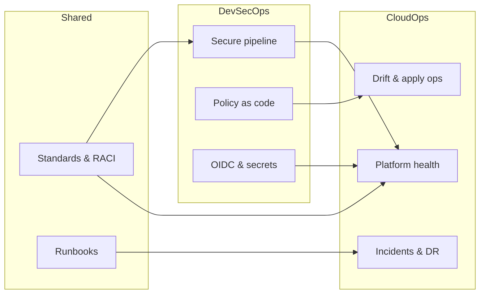

# CloudOps & DevSecOps — Roles, Tasks & Kickstart Alignment

**Audience:** CloudOps / Platform Operations, DevSecOps, Cloud COE leads, Security, App teams  
**Platform:** AWS + GitHub Actions + this Terraform module library  
**Purpose:** Define what **CloudOps** and **DevSecOps** own, how each team achieves its work, and what must be **aligned before kickoff**  
**Companion docs:** [ENTERPRISE_CLOUD_GOVERNANCE.md](./ENTERPRISE_CLOUD_GOVERNANCE.md) · [ENTERPRISE_GITHUB_GOVERNANCE.md](./ENTERPRISE_GITHUB_GOVERNANCE.md)  
**Last updated:** 2026-08-17  

---

## 1. Why separate CloudOps and DevSecOps?

| Team | Focus question | Success looks like |
|------|----------------|--------------------|
| **CloudOps** | “Is the platform healthy, operated, and recoverable?” | Stable accounts, pipelines that deploy, incidents handled, drift fixed |
| **DevSecOps** | “Is change secure by default before it reaches AWS?” | Security in CI/CD, preventative controls, secrets/OIDC, policy-as-code gates |

They **collaborate daily** but should not blur ownership:

```
  Developer / App Team
           │
           │  Pull Request
           ▼
  ┌────────────────────┐
  │     DevSecOps      │  ← shift-left security & delivery safety
  │  scans · OIDC ·    │
  │  policy gates ·    │
  │  pipeline design   │
  └─────────┬──────────┘
            │  approved artifact / plan
            ▼
  ┌────────────────────┐
  │     CloudOps       │  ← run, observe, recover the estate
  │  accounts · LZ ·   │
  │  apply ops · IR ·  │
  │  backup / DR       │
  └─────────┬──────────┘
            ▼
         AWS Estate
```

---

## 2. CloudOps — roles and tasks

### 2.1 CloudOps mission

Operate and improve the **AWS multi-account platform** so application teams can consume governed infrastructure reliably.

### 2.2 Suggested CloudOps roles

| Role | Primary duty |
|------|----------------|
| **CloudOps Lead** | Own operational SLAs, on-call model, escalation to COE/CAB |
| **Landing Zone Operator** | Control Tower / Organizations / OU health, account readiness |
| **Platform Ops Engineer** | Module upgrades in lower envs, pipeline apply ops, state backends |
| **Observability Engineer (Cloud)** | Central logging/metrics/alerts, dashboards, SLO wiring |
| **Incident Commander (Cloud)** | Major incidents, communication, post-incident actions |
| **Capacity / Reliability Engineer** | Quotas, limits, scaling, DR drills |

*(In smaller orgs, 2–3 people wear multiple roles.)*

### 2.3 CloudOps task catalog

| Domain | Tasks CloudOps owns |
|--------|---------------------|
| **Accounts & LZ** | Monitor CT enrollment; handle failed accounts; OU moves with change control; freeze / suspend risky accounts |
| **Access (ops side)** | Break-glass checkout procedure; periodic access attestations with Identity; emergency role unlock |
| **Terraform ops** | Remote state health (S3/DynamoDB); unlock stuck state; coordinate module version upgrades; approve emergency apply |
| **Pipelines (ops side)** | Watch failed applies; re-run after root-cause fix; maintain runner capacity if self-hosted |
| **Observability** | Org CloudTrail/Config visibility; GuardDuty/Security Hub triage routing; platform alarms |
| **Backup / DR** | Backup vault ownership, restore tests, RTO/RPO evidence |
| **Patch / baseline** | AMI / account customization refresh cadence with COE |
| **Cost (ops)** | Act on budget alarms; cleanup idle nonprod with FinOps |
| **Incidents** | 24×7 or business-hours on-call; runbooks; status updates |
| **Compliance support** | Provide operational evidence (logs retained, restore tests done) |

### 2.4 How CloudOps achieves its tasks (practical path)

| Goal | How to achieve it (with this stack) |
|------|-------------------------------------|
| Keep landing zone healthy | Use Control Tower dashboard + Config aggregator; ticket CT/AFT failures to COE; track in ops board |
| Know what changed | Require all prod changes via GitHub Actions; ban console clickops except break-glass |
| Detect problems early | Wire `observability/*` baselines; CloudWatch alarms → SNS/incident tool |
| Recover fast | Runbooks in repo/wiki; tested restore from `storage/backup-*` patterns; separate state per env |
| Control drift | Scheduled `terraform plan` job; CloudOps triages drift; App/COE fixes via PR |
| Operate modules safely | Never edit prod by hand; apply through blueprint root + env tfvars ([structure guide](./TERRAFORM_STRUCTURE_AND_USAGE.md)) |
| Account lifecycle ops | Work with ServiceNow status callbacks ([account provisioning](./SERVICENOW_AWS_ACCOUNT_PROVISIONING.md)) |

### 2.5 CloudOps weekly / monthly rhythm

| Cadence | Activity |
|---------|----------|
| Daily | Pipeline fail review, Sev1/Sev2 queue, GuardDuty high findings |
| Weekly | Drift report, budget anomalies, open change risks |
| Monthly | Restore test sample, access review support, LZ health report to CAB |
| Quarterly | DR game day, capacity review, module upgrade wave planning |

---

## 3. DevSecOps — roles and tasks

### 3.1 DevSecOps mission

Embed **security, compliance, and safe delivery** into every change **before** it lands in AWS — especially via GitHub Actions and IaC.

### 3.2 Suggested DevSecOps roles

| Role | Primary duty |
|------|----------------|
| **DevSecOps Lead** | Own pipeline security standards and gate policy |
| **CI/CD Security Engineer** | GitHub Actions hardening, OIDC trust, Environments |
| **IaC Security Engineer** | Checkov/tfsec/OPA policies; module guardrail reviews |
| **Secrets & Identity Pipeline Engineer** | No static keys; secret scanning; short-lived credentials |
| **AppSec Champion (Cloud)** | Threat model golden paths; secure defaults in blueprints |
| **Supply-chain Engineer** | Action pinning, artifact integrity, dependency/image scans |

### 3.3 DevSecOps task catalog

| Domain | Tasks DevSecOps owns |
|--------|----------------------|
| **Pipeline design** | Plan-on-PR, apply-on-approval; reusable workflows; environment protection |
| **AuthN to AWS** | GitHub OIDC → IAM roles; deny long-lived access keys in Actions |
| **Policy-as-code** | Fail build on critical misconfigs (public S3, open SG, unencrypted data) |
| **Secrets** | Secret scanning, push protection, rotation patterns |
| **PR security** | CODEOWNERS for sensitive paths; required reviews; signed commits (if mandated) |
| **Module security** | Review new modules for guardrails; block unsafe defaults |
| **Vulnerability gates** | Container/deps scanning where apps ship images |
| **Evidence** | Retain plan + scan artifacts for audit |
| **Threat modeling** | Golden-path threat models with Security team |
| **Secure enablement** | Train app teams on secure PR patterns |

### 3.4 How DevSecOps achieves its tasks (practical path)

| Goal | How to achieve it (with this stack) |
|------|-------------------------------------|
| Stop bad IaC early | Add Checkov/tfsec/Conftest to Actions before `apply` ([governance §4.6](./ENTERPRISE_CLOUD_GOVERNANCE.md)) |
| No static AWS keys | Configure OIDC IdP + per-env IAM roles; use `aws-actions/configure-aws-credentials` |
| Protect prod | GitHub Environments with required reviewers; separate prod OIDC role |
| Enforce tagging / encryption | Module preconditions + policy-as-code; prefer enterprise modules (`storage/s3-bucket`, `identity/iam-role`) |
| Harden workflows | Pin Actions SHAs; least `permissions:`; no `pull_request_target` secrets abuse |
| Prove controls | Upload SARIF/scan reports; keep plan artifacts; map controls to Compliance matrix |
| Scale org-wide | Start in this repo’s workflow; promote to org reusable workflows |

### 3.5 DevSecOps pipeline ownership map

```
 PR opened
   │
   ├─► fmt / validate / tflint          (DevSecOps + COE)
   ├─► Checkov / OPA / secrets scan     (DevSecOps) ← BLOCK on critical
   ├─► terraform plan                   (DevSecOps enables; CloudOps watches)
   │
   ▼
 Approval (GitHub Environment / CAB for prod)
   │
   └─► terraform apply                  (CloudOps operational accountability;
                                         DevSecOps owns that the gate was secure)
```

---

## 4. CloudOps vs DevSecOps — clear boundaries

| Topic | CloudOps | DevSecOps | Shared |
|-------|----------|-----------|--------|
| Landing zone day-2 ops | **Owner** | Consulted | COE design |
| Writing security policies in CI | Consulted | **Owner** | Security GRC |
| OIDC IAM role trust policy | Consulted | **Owner** | CloudOps validates blast radius |
| Apply failures in prod | **Owner** (restore service) | Supports root-cause if gate missed | Incident bridge |
| New Terraform module guardrails | Consulted | **Owner** (security requirements) | COE implements |
| GuardDuty / Sev alerts | **Owner** (triage/ops) | Improves detections-as-code | Security |
| Runner / Actions uptime | Shared (self-hosted: CloudOps) | Hardening standards | GitHub Admin |
| Prod approval policy | Enforces change window | Defines technical gate | CAB |
| Break-glass AWS access | **Owner** of procedure | Audits misuse patterns | Identity |

### Hand-off rule

> **DevSecOps decides if a change is allowed through the pipe.**  
> **CloudOps decides if the platform stays healthy after the change.**

---

## 5. How both teams kick-start work together

### 5.1 Alignment before day 1 (must lock)

Do **not** start tooling until these are agreed:

| # | Alignment item | CloudOps input | DevSecOps input | Decision owner |
|---|----------------|----------------|-----------------|----------------|
| 1 | Prod definition & OU map | Ops constraints | Control implications | COE + CAB |
| 2 | Mandatory tags & naming | Ops/CMDB needs | Policy checks to enforce | COE + FinOps |
| 3 | Branch & environment model | Apply windows | Gate design | DevSecOps + GitHub Admin |
| 4 | OIDC role naming & trust | Least privilege ops roles | Trust conditions (`sub`, env) | DevSecOps + COE |
| 5 | Critical vs warn policy list | Ops false-positive tolerance | Block list | Security + DevSecOps |
| 6 | On-call & escalation matrix | Primary pager | Pipeline Sev routing | CloudOps Lead |
| 7 | Break-glass process | Execution | Detection/audit | CloudOps + Identity |
| 8 | State retention (logs/plans) | Cost/ops | Audit needs | Compliance |
| 9 | What App teams may change | Env tfvars only | PR checks they must pass | COE |
| 10 | Tooling stack | Observability tools | Scanner tools | Joint |

### 5.2 Kickstart backlog (first 30 days)

#### Week 1 — Align & access

| Team | Deliverable |
|------|-------------|
| Both | RACI sign-off (this doc §4 + §8) |
| Both | Access to GitHub repo + AWS SSO groups |
| DevSecOps | Draft workflow permissions & environment rules |
| CloudOps | Confirm state backend pattern + on-call calendar draft |

#### Week 2 — Secure path to one AWS account

| Team | Deliverable |
|------|-------------|
| DevSecOps | OIDC provider + `dev` deploy role working from Actions |
| DevSecOps | `fmt` / `validate` / Checkov on PR |
| CloudOps | Dev account readiness checklist (logging, baseline alarms) |
| Both | Successful `plan` on `three-tier-webapp` (or chosen blueprint) |

#### Week 3 — Operate the path

| Team | Deliverable |
|------|-------------|
| CloudOps | Drift job schedule + triage runbook |
| CloudOps | Incident runbook v1 (pipeline fail, apply fail, LZ fail) |
| DevSecOps | `test`/`prod` environment protection + approvers |
| DevSecOps | Secret scanning + push protection enabled |

#### Week 4 — Harden & demonstrate

| Team | Deliverable |
|------|-------------|
| Both | Tabletop: “malicious PR tries public S3” → gate blocks |
| Both | Tabletop: “apply fails mid-way” → CloudOps recovery |
| DevSecOps | Policy fail metrics dashboard (even if simple) |
| CloudOps | Backup/restore proof for one critical resource class |

### 5.3 Kickstart readiness checklist (go / no-go)

- [ ] CloudOps Lead and DevSecOps Lead named  
- [ ] Shared Slack/Teams channel + incident bridge process  
- [ ] AWS Identity Center groups for both teams  
- [ ] GitHub CODEOWNERS for `.github/workflows`, `modules/`, `compositions/`  
- [ ] OIDC to at least **dev** AWS account proven  
- [ ] No long-lived AWS keys in GitHub secrets  
- [ ] Policy-as-code critical rules agreed in writing  
- [ ] Remote state exists and is backed up / versioned  
- [ ] First blueprint plan succeeds in CI  
- [ ] On-call + escalation published  

---

## 6. Operating model diagrams

### 6.1 Day-to-day change flow

```
 App Engineer
    │ create PR (blueprint / tfvars / rarely module)
    ▼
 DevSecOps gates
    │ lint → secure scan → plan
    │ fail? ──► engineer fixes
    ▼
 Approvals
    │ env reviewers / change ticket (prod)
    ▼
 Apply (Actions OIDC)
    ▼
 CloudOps monitors
    │ success → close change
    │ failure → incident / rollback / fix-forward PR
```

### 6.2 Responsibility swimlane



---

## 7. Tooling alignment (recommended starter set)

| Concern | CloudOps leaning | DevSecOps leaning |
|---------|------------------|-------------------|
| CI/CD | Runner health, apply retries | Workflow security, gates |
| IaC | Terraform ops, state | Module/policy security |
| Security monitoring | GuardDuty/Security Hub ops | Detection-as-code improvements |
| Quality | SLO of platform | Pass rate of security gates |
| Docs | Runbooks, on-call | Pipeline standards, threat models |

Use existing starters in this repo:

- `terraform/pipelines/terraform/github-actions-blueprint.yml`  
- Modules under `security/*`, `observability/*`, `identity/*`  

---

## 8. Joint RACI (CloudOps × DevSecOps focus)

| Activity | CloudOps | DevSecOps | COE | Security |
|----------|----------|-----------|-----|----------|
| Define CI security gates | C | **A/R** | C | C |
| Implement OIDC roles | C | **R** | **A** | C |
| Operate failed applies | **A/R** | C | C | I |
| LZ / account operational health | **A/R** | I | C | C |
| Policy-as-code rule content | C | **R** | C | **A** |
| Break-glass execution | **A/R** | C | C | C |
| Break-glass audit | C | **R** | I | **A** |
| Drift triage | **A/R** | C | C | I |
| Prod environment approvers list | C | **R** | C | C |
| Incident Sev1 cloud platform | **A/R** | C | C | C |
| Module secure defaults | C | **R** | **A** | C |
| Observability baselines ops | **A/R** | C | C | I |

---

## 9. First artifacts each team should create

### CloudOps

1. Platform on-call rota + escalation  
2. Runbook: Actions apply failure  
3. Runbook: Control Tower / AFT account stuck  
4. Runbook: State lock / backend incident  
5. Weekly LZ & drift report template  

### DevSecOps

1. Pipeline security standard (1–2 pages)  
2. OIDC trust policy standard  
3. Critical Checkov/OPA rule list (block vs warn)  
4. GitHub Environment protection matrix (dev/test/prod)  
5. Secure PR checklist for app teams  

---

## 10. 60-day outcomes (definition of kickstart success)

| Outcome | Evidence |
|---------|----------|
| Secure path to cloud exists | PR → gated plan → OIDC apply to dev |
| Ops can run the path | CloudOps closes apply incidents without DevSecOps heroics |
| Shared language | Both teams use same RACI and severity definitions |
| No secret sprawl | Zero static AWS keys in GitHub |
| Repeatable | Second blueprint or second env onboarded using same pattern |

---

## 11. References

| Topic | Link |
|-------|------|
| Enterprise governance (parent) | [ENTERPRISE_CLOUD_GOVERNANCE.md](./ENTERPRISE_CLOUD_GOVERNANCE.md) |
| Enterprise GitHub governance | [ENTERPRISE_GITHUB_GOVERNANCE.md](./ENTERPRISE_GITHUB_GOVERNANCE.md) |
| Terraform root / env model | [TERRAFORM_STRUCTURE_AND_USAGE.md](./TERRAFORM_STRUCTURE_AND_USAGE.md) |
| GitHub Actions OIDC → AWS | https://docs.github.com/en/actions/deployment/security-hardening-your-deployments/configuring-openid-connect-in-amazon-web-services |
| Security hardening for Actions | https://docs.github.com/en/actions/security-guides/security-hardening-for-github-actions |
| AWS Well-Architected — Security | https://docs.aws.amazon.com/wellarchitected/latest/security-pillar/welcome.html |
| AWS Well-Architected — Operational Excellence | https://docs.aws.amazon.com/wellarchitected/latest/operational-excellence-pillar/welcome.html |
| IAM best practices | https://docs.aws.amazon.com/IAM/latest/UserGuide/best-practices.html |
| AWS incident response resources | https://docs.aws.amazon.com/whitepapers/latest/aws-security-incident-response-guide/welcome.html |

---

## 12. Document history

| Date | Change |
|------|--------|
| 2026-08-17 | Linked enterprise GitHub governance companion |
| 2026-08-10 | Initial CloudOps & DevSecOps roles, tasks, achievement paths, and kickstart alignment guide |
