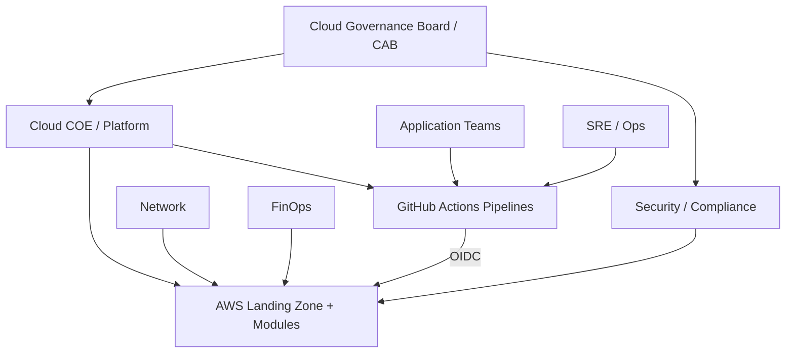
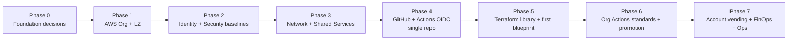

# Enterprise Cloud Governance Standards (AWS + GitHub Actions)

**Audience:** Executives, Cloud COE, Security, Network, FinOps, Compliance, App teams, SRE  
**Platform:** Amazon Web Services (AWS)  
**Delivery:** GitHub + GitHub Actions (start single-repo → scale to Organization standards)  
**IaC model:** This repo’s layered Terraform library (`modules` → `compositions` → `blueprints` → `environments`)  
**Last updated:** 2026-08-10  

---

## 1. Purpose and outcomes

This document defines **enterprise cloud governance** for an AWS estate delivered with **GitHub Actions**.

After following it, the organization should have:

1. Clear **teams, duties, and decision rights**  
2. A **governed AWS multi-account foundation** (landing zone)  
3. **Standards** for identity, network, security, cost, and operations  
4. A **GitHub Actions** path from one repo to org-wide pipelines (OIDC, no long-lived keys)  
5. A practical **from-scratch setup checklist**  

### Related repo docs

| Doc | Use when |
|-----|----------|
| [TERRAFORM_STRUCTURE_AND_USAGE.md](./TERRAFORM_STRUCTURE_AND_USAGE.md) | Root module vs project vs environment |
| [REUSABLE_MODULES_GUIDE.md](./REUSABLE_MODULES_GUIDE.md) | Module catalog and reuse |
| [SERVICENOW_AWS_ACCOUNT_PROVISIONING.md](./SERVICENOW_AWS_ACCOUNT_PROVISIONING.md) | Ticket → approved AWS account |
| [Guide/README.md](../Guide/README.md) | Keep catalogs updated |

---

## 2. Governance vision (one picture)

```
                         ┌──────────────────────────────────────┐
                         │     ENTERPRISE CLOUD GOVERNANCE      │
                         │  Policies · Standards · Guardrails   │
                         └──────────────────┬───────────────────┘
                                            │
          ┌─────────────────────────────────┼─────────────────────────────────┐
          ▼                                 ▼                                 ▼
 ┌─────────────────┐               ┌─────────────────┐               ┌─────────────────┐
 │ PEOPLE          │               │ PLATFORM (AWS)  │               │ DELIVERY (GitHub)│
 │ Teams + RACI    │               │ Accounts / LZ   │               │ Actions + OIDC  │
 │ Approvals       │               │ Modules / Ctls  │               │ Plan → Apply    │
 └────────┬────────┘               └────────┬────────┘               └────────┬────────┘
          │                                 │                                 │
          └─────────────────────────────────┴─────────────────────────────────┘
                                            │
                                            ▼
                              Safe, repeatable cloud change
                              (dev → test → prod)
```

### Mermaid overview



---

## 3. Teams to involve and their duties

### 3.1 Team map (enterprise-full)

| Team | Primary mission | Must be involved when… |
|------|-----------------|------------------------|
| **Cloud Governance Board / CAB** | Decisions, exceptions, risk acceptance | Org-wide policy, prod exceptions, funding |
| **Cloud COE / Platform Engineering** | Landing zone, modules, pipelines, golden paths | Any shared platform / IaC / account design |
| **Security Engineering** | Threat model, IAM, logging, GuardDuty/Security Hub, vuln gates | Identity, crypto, public exposure, prod |
| **Compliance / GRC** | Frameworks (SOC2, ISO, PCI…), evidence | Control design, audit packages |
| **Network Engineering** | Connectivity, DNS, firewall, hybrid | Shared VPC/TGW, ingress/egress, PrivateLink |
| **Identity / IAM (enterprise IdP)** | SSO, groups, Joiner-Mover-Leaver | Identity Center, permission sets, break-glass |
| **FinOps / Cloud Financial Management** | Budgets, tagging, chargeback | Account structure, cost policies, budgets |
| **Application / Product teams** | Build features on approved paths | New apps, env tfvars, runtime ownership |
| **SRE / Cloud Operations** | Runbooks, SLOs, incident response | Monitoring, on-call, DR |
| **DevEx / GitHub Admins** | Org, repos, Actions runners, branch protection | CI/CD standards, secrets, OIDC apps |
| **Data / Privacy (as needed)** | Data classification, residency | Sensitive data workloads |
| **ServiceNow / ITSM** | Intake, approvals, CMDB | Account vending and change tickets |

### 3.2 Duties by team (RACI-style)

Legend: **A** = Accountable, **R** = Responsible, **C** = Consulted, **I** = Informed

| Activity | CAB | COE | Security | Network | FinOps | Identity | App | SRE | GitHub Admin | Compliance |
|----------|-----|-----|----------|---------|--------|----------|-----|-----|--------------|------------|
| Cloud strategy / policy | A | R | C | C | C | C | I | C | I | C |
| Landing zone (CT / Orgs) | A | R | C | C | C | C | I | C | I | C |
| Account OU design | A | R | C | C | C | I | I | I | I | C |
| SCP / guardrails | A | R | R | C | C | C | I | I | I | C |
| Network hub / shared services | I | C | C | A/R | I | I | I | C | I | I |
| Identity Center + MFA | I | C | C | I | I | A/R | I | I | I | C |
| Terraform module library | I | A/R | C | C | I | C | C | C | I | I |
| Blueprint / golden paths | I | A/R | C | C | I | I | C | C | I | I |
| Env tfvars / app stacks | I | C | C | C | C | I | A/R | C | I | I |
| GitHub Actions org standards | I | C | C | I | I | I | C | C | A/R | I |
| OIDC roles to AWS | I | R | C | I | I | C | I | I | R | I |
| Security scanning in CI | I | C | A/R | I | I | I | R | C | C | C |
| Cost tags / budgets | I | C | I | I | A/R | I | R | I | I | I |
| Observability baselines | I | R | C | I | I | I | C | A/R | I | I |
| Incident response for cloud | I | C | C | C | I | C | C | A/R | I | I |
| Audit evidence collection | I | C | C | I | C | C | I | C | I | A/R |
| ServiceNow account request | I | C | C | I | C | C | R | I | I | I |
| Prod apply approval gate | A | C | C | I | I | I | R | C | C | I |

### 3.3 Named roles (minimum staffing targets)

| Role | Typical home team | Critical duties |
|------|-------------------|-----------------|
| Cloud Governance Lead | CAB / COE | Own this document; exception process |
| Landing Zone Owner | COE | Control Tower / Orgs health |
| Module Library Owner | COE | `modules/` + compositions quality |
| Pipeline Owner | COE + GitHub Admin | Actions workflows, OIDC, promotion |
| Security Champion (Cloud) | Security | Controls in code + CI gates |
| Network Champion (Cloud) | Network | Hybrid + shared networking standards |
| FinOps Analyst | FinOps | Tags, budgets, showback |
| Identity Owner (Cloud) | Identity | SSO groups / permission sets |
| App Tech Lead | App team | Uses blueprints; owns env values |
| On-call SRE | SRE | Ops for platform + production incidents |

### References — Section 3

| Topic | Link |
|-------|------|
| AWS CAF (Cloud Adoption Framework) | https://docs.aws.amazon.com/whitepapers/latest/overview-aws-cloud-adoption-framework/overview-aws-cloud-adoption-framework.html |
| Organizing your AWS environment | https://docs.aws.amazon.com/whitepapers/latest/organizing-your-aws-environment/organizing-your-aws-environment.html |
| AWS Shared Responsibility Model | https://aws.amazon.com/compliance/shared-responsibility-model/ |

---

## 4. Enterprise standards (what “good” looks like)

### 4.1 Account & organization standards

| Standard | Requirement |
|----------|-------------|
| Multi-account | Separate Management, Log Archive, Audit, Shared Services, workload OUs |
| OUs | At least Sandbox / NonProd / Prod / Suspended (extend as needed) |
| Provisioning | Control Tower + AFT preferred; ServiceNow intake for requests |
| Root user | No daily use; MFA; break-glass only |
| Regions | Allow-list regions via SCP |
| Tags (mandatory) | `Environment`, `Owner`, `CostCenter`, `Application`, `DataClassification`, `ManagedBy` |

### 4.2 Identity & access standards

| Standard | Requirement |
|----------|-------------|
| Human access | IAM Identity Center + corporate IdP |
| Permission model | Least privilege permission sets; no long-lived IAM users for humans |
| Machine access | GitHub Actions → AWS via **OIDC** (no static access keys in GitHub secrets) |
| Break-glass | Documented dual-control break-glass roles |
| Privileged sessions | Session limits, CloudTrail review |

### 4.3 Security & compliance standards

| Standard | Requirement |
|----------|-------------|
| Logging | Org CloudTrail → Log Archive; immutable retention per policy |
| Detection | GuardDuty + Security Hub + Config rules (minimum) |
| Encryption | CMK/SSE standards per data class; TLS in transit |
| Secrets | Secrets Manager / SSM; never commit secrets |
| CI gates | `fmt`, `validate`, `tflint`, Checkov/tfsec, OPA/Conftest as agreed |
| Vulnerability | Scan images/deps before deploy where applicable |

### 4.4 Network standards

| Standard | Requirement |
|----------|-------------|
| Internet | Controlled egress (NAT / firewall patterns); no open `0.0.0.0/0` SSH/RDP |
| Ingress | Prefer ALB/NLB + WAF; private by default |
| Connectivity | TGW / shared services patterns for multi-account |
| DNS | Central Private Hosted Zones / Resolver standards |

### 4.5 FinOps standards

| Standard | Requirement |
|----------|-------------|
| Tag enforcement | Required tags on create (SCP/Config/policy-as-code) |
| Budgets | Account / project budgets + alerts |
| Rightsizing | Periodic review for nonprod |
| Chargeback | CostCenter + Application tags mandatory |

### 4.6 Delivery standards (GitHub Actions)

| Standard | Requirement |
|----------|-------------|
| Branching | `main` protected; PR required |
| Environments | GitHub Environments: `dev`, `test`, `prod` with protection rules |
| Plan | Automatic on PR |
| Apply | Manual approval for `test`/`prod` (and optionally `dev`) |
| Auth to AWS | OIDC federation to IAM roles per env/account |
| Artifacts | Plan files retained; SBOM/scan reports retained |
| Path filters | Module PRs may not auto-apply prod workloads without promotion process |

### References — Section 4

| Topic | Link |
|-------|------|
| Control Tower | https://docs.aws.amazon.com/controltower/latest/userguide/what-is-control-tower.html |
| Identity Center | https://docs.aws.amazon.com/singlesignon/latest/userguide/what-is.html |
| SCPs | https://docs.aws.amazon.com/organizations/latest/userguide/orgs_manage_policies_scps.html |
| Tagging best practices | https://docs.aws.amazon.com/whitepapers/latest/tagging-best-practices/tagging-best-practices.html |
| GitHub Actions OIDC with AWS | https://docs.github.com/en/actions/deployment/security-hardening-your-deployments/configuring-openid-connect-in-amazon-web-services |
| AWS IAM OIDC IdP | https://docs.aws.amazon.com/IAM/latest/UserGuide/id_roles_providers_create_oidc.html |

---

## 5. Target operating model with this Terraform repo

```
 PEOPLE / PROCESS                    PLATFORM                           DELIVERY
 ─────────────────                   ────────                           ────────
 ServiceNow request ──► Account ──► modules/compositions ──► blueprints (ROOT)
 Approvals               READY        (library)                 + env tfvars
                                                                    │
                                                                    ▼
                                                            GitHub Actions
                                                            plan / apply
                                                                    │
                                                                    ▼
                                                               AWS account
```

| Layer | Owner | Change method |
|-------|-------|---------------|
| `modules/` | COE | PR + review + version/tag |
| `compositions/` | COE | PR + review |
| `blueprints/` | COE (+ app for project-specific) | PR + review |
| `environments/*.tfvars` | App team (with COE review for prod) | PR |
| Actions workflows | COE + GitHub Admin | PR |
| Accounts / OU | COE + CAB | Controlled change |

---

## 6. From scratch — setup overview (phases)



---

## 7. From scratch — detailed phase guide

### Phase 0 — Foundation decisions (1–2 weeks)

**Teams:** CAB, COE, Security, Network, FinOps, Identity, GitHub Admin, Compliance  

Checklist:

1. Confirm AWS is the primary cloud.  
2. Decide Control Tower **home Region**.  
3. Draft OU model and naming (`aws-<bu>-<app>-<env>`).  
4. Draft mandatory tags + data classifications.  
5. Decide GitHub model: start **one repo** (`AWS-Modules` or platform repo) → later **GitHub Organization** standards.  
6. Confirm IdP for Identity Center.  
7. Approve this governance document.  

**Exit:** Signed decisions + RACI owners named.

---

### Phase 1 — AWS Organization & landing zone

**Teams:** COE (A/R), Security (C), Network (C), FinOps (C), CAB (A)

1. Create / use AWS Organization management account.  
2. Enable CloudTrail (org), budgets on management.  
3. Deploy **AWS Control Tower** landing zone (Log Archive + Audit).  
4. Create OUs: Sandbox, NonProd, Prod, Suspended (minimum).  
5. Apply baseline SCPs (deny leaving org, deny unsafe regions, protect security services).  
6. Plan AFT deployment (or temporary Account Factory process).  

**Exit:** Landing zone healthy; can create a sandbox account under governance.

References:

- https://docs.aws.amazon.com/controltower/latest/userguide/getting-started-with-control-tower.html  
- https://docs.aws.amazon.com/organizations/latest/userguide/orgs_introduction.html  

---

### Phase 2 — Identity & security baselines

**Teams:** Identity (A for SSO), Security (A for detections), COE (R integration)

1. Configure **IAM Identity Center** with corporate IdP.  
2. Define permission sets: `ReadOnly`, `PowerUser`, `Admin` (break-glass), `PlatformOps`.  
3. Map groups → accounts/OUs.  
4. Enable GuardDuty, Security Hub, Config aggregator (org).  
5. Define encryption standards (KMS key ownership).  
6. Document break-glass procedure.  

**Exit:** Humans login via SSO only; detection stack on.

References:

- https://docs.aws.amazon.com/singlesignon/latest/userguide/what-is.html  
- https://docs.aws.amazon.com/securityhub/latest/userguide/what-is-securityhub.html  

---

### Phase 3 — Network & shared services

**Teams:** Network (A/R), COE (C), Security (C), SRE (C)

1. Design hub/spoke or Inspection/Egress/Shared Services model.  
2. Deploy shared DNS / endpoints strategy.  
3. Define private connectivity (DX/VPN) if hybrid.  
4. Encode patterns into `modules/network` + `compositions/network`.  

**Exit:** Approved network reference architecture + first shared services account baselines.

---

### Phase 4 — GitHub + Actions (start **single repo**, then scale)

#### 4A — Single-repo bootstrap (do this first)

**Teams:** GitHub Admin (A), COE (R), Security (C)

1. Create GitHub repository (this library / platform repo).  
2. Protect `main`: PR required, status checks required, no force-push.  
3. Add CODEOWNERS for `modules/`, `compositions/`, `.github/workflows/`.  
4. Create GitHub Environments: `dev`, `test`, `prod` (prod = required reviewers).  
5. In AWS, create IAM OIDC provider for GitHub.  
6. Create IAM roles per environment/account, trust conditioned on:  
   - `token.actions.githubusercontent.com`  
   - specific `sub` (repo + environment/ref)  
7. Add workflow (see repo `terraform/pipelines/terraform/github-actions-blueprint.yml` as starter).  
8. Pipeline stages (minimum):  
   - `terraform fmt -check`  
   - `terraform init/validate`  
   - `tflint` / Checkov  
   - `terraform plan` (PR comment / artifact)  
   - `terraform apply` (environment protection)  

```
 Developer ──PR──► GitHub Actions (plan + scan)
                      │
                      │ approve (GitHub Environment)
                      ▼
                   OIDC assume role ──► AWS account
                      │
                      ▼
                   terraform apply
```

#### 4B — Scale to **GitHub Organization** standards

**Teams:** GitHub Admin (A), COE (C), Security (C), CAB (I)

1. Standardize org settings: 2FA, base permissions, SSO.  
2. Create org reusable workflows / actions for Terraform.  
3. Runner strategy (GitHub-hosted vs private hardened runners).  
4. Org rulesets for branch protection.  
5. Secret scanning + push protection ON.  
6. Separate repos later if needed:  
   - `aws-landing-zone`  
   - `aws-modules` (this)  
   - `app-<name>-infra` (calls modules via git ref tags)  

**Exit:** At least one successful OIDC plan/apply to a **dev** account from GitHub Actions.

References:

- https://docs.github.com/en/actions/deployment/security-hardening-your-deployments/configuring-openid-connect-in-amazon-web-services  
- https://docs.aws.amazon.com/IAM/latest/UserGuide/id_roles_providers_create_oidc.html  
- https://docs.github.com/en/actions/deployment/targeting-different-environments/using-environments-for-deployment  

---

### Phase 5 — Terraform library + first golden path

**Teams:** COE (A/R), App pilot team (C), Security (C)

1. Confirm layered structure is the standard (`modules` → `compositions` → `blueprints` → `environments`).  
2. Publish module catalog ([REUSABLE_MODULES_GUIDE.md](./REUSABLE_MODULES_GUIDE.md)).  
3. Wire Actions to a blueprint root, e.g. `blueprints/three-tier-webapp`.  
4. Create `environments/dev|test|prod/*.tfvars`.  
5. Separate state backends per env/account (S3 + lock).  
6. Pilot one nonprod workload end-to-end.  

**Exit:** Pilot app deployed via blueprint + tfvars + Actions (no console clickops).

---

### Phase 6 — Promotion and quality gates (org Actions maturity)

**Teams:** COE, GitHub Admin, Security, SRE, App leads

Promotion path:

```
 PR to main
   │
   ├─ plan(dev)   ── auto
   ├─ apply(dev)  ── auto or 1 approval
   ├─ plan(test)  ── on merge / tag
   ├─ apply(test) ── environment approval
   ├─ plan(prod)
   └─ apply(prod) ── CAB / change ticket + environment approvers
```

Require:

1. Policy-as-code fail builds on critical findings.  
2. Prod apply requires ticket ID (ServiceNow change) in workflow input.  
3. Drift detection job (scheduled plan).  
4. Module version pinning for app repos (git tags).  

---

### Phase 7 — Account vending, FinOps, operations

**Teams:** COE, ServiceNow, FinOps, SRE, Security

1. Implement ServiceNow → account provisioning ([guide](./SERVICENOW_AWS_ACCOUNT_PROVISIONING.md)).  
2. Enforce budgets + anomaly detection on every account.  
3. Standard onboarding runbook for Product Owners.  
4. Define SRE SLOs for platform (pipeline success, time-to-account, LZ health).  
5. Quarterly access reviews + SCP reviews.  

**Exit:** New account requestable via ticket; cost and ops telemetry live.

---

## 8. Exception management

| Severity | Example | Approvers | Max duration |
|----------|---------|-----------|--------------|
| Low | Extra region for POC | COE | 30 days |
| Medium | Temporary admin for migration | COE + Security | 14 days |
| High | Disable control / public exposure exception | CAB + Security + Compliance | Time-boxed + compensating controls |

Every exception must record: ticket ID, risk, compensating controls, expiry, owner.

---

## 9. Metrics that prove governance works

| KPI | Starter target |
|-----|----------------|
| % of prod changes via GitHub Actions | ≥ 95% |
| Time approve→READY for new AWS account | ≤ 8 business hours (tune) |
| Critical policy scan failures reaching prod | 0 |
| Accounts missing mandatory tags | 0 (or trending to 0) |
| Break-glass uses / month | Tracked + reviewed |
| Drift open > 7 days | 0 critical |

---

## 10. 90-day from-scratch plan (executive view)

| Days | Focus | Outcome |
|------|-------|---------|
| 0–15 | Phase 0–1 | Org + Control Tower foundations |
| 16–30 | Phase 2 | SSO + security detections |
| 31–45 | Phase 3–4A | Network design + GitHub OIDC single-repo pipeline |
| 46–60 | Phase 5 | First blueprint deployed to dev via Actions |
| 61–75 | Phase 6 | Test/prod gates + scans |
| 76–90 | Phase 7 | Account vending pilot + FinOps + ops runbooks |

---

## 11. Minimum control checklist (audit-ready)

- [ ] Multi-account OU model documented and implemented  
- [ ] Control Tower (or approved LZ) operational  
- [ ] Identity Center + MFA enforced  
- [ ] Org CloudTrail immutable  
- [ ] GuardDuty / Security Hub / Config enabled  
- [ ] SCP denylist for unsafe actions/regions  
- [ ] Mandatory tagging standard published  
- [ ] GitHub branch protection + CODEOWNERS  
- [ ] Actions → AWS via OIDC only  
- [ ] Separate state per environment  
- [ ] Plan on PR; protected apply on prod  
- [ ] Incident + break-glass runbooks tested  
- [ ] Exception register exists  

---

## 12. RACI for from-scratch program

| Workstream | Accountable | Responsible | Consulted |
|------------|-------------|-------------|-----------|
| Governance charter | CAB | Cloud Governance Lead | All vertical leads |
| Landing zone | COE Lead | LZ engineer | Security, Network, FinOps |
| Identity | Identity Lead | IAM engineers | Security, COE |
| Network | Network Lead | Cloud network engineers | Security, COE |
| Modules / IaC | COE Lead | Platform engineers | App Tech Leads, Security |
| GitHub Actions | GitHub Admin | Platform + DevEx | Security, COE |
| Security controls | CISO delegate | Cloud security eng | Compliance, COE |
| FinOps | FinOps Lead | FinOps analysts | COE, App Owners |
| Operations | SRE Lead | SRE on-call | COE, App Owners |
| Compliance evidence | Compliance Lead | GRC analysts | Security, COE |

---

## 13. Master references

### AWS

| Topic | Link |
|-------|------|
| CAF overview | https://docs.aws.amazon.com/whitepapers/latest/overview-aws-cloud-adoption-framework/overview-aws-cloud-adoption-framework.html |
| Multi-account strategy | https://docs.aws.amazon.com/whitepapers/latest/organizing-your-aws-environment/organizing-your-aws-environment.html |
| Control Tower | https://docs.aws.amazon.com/controltower/latest/userguide/what-is-control-tower.html |
| AFT | https://docs.aws.amazon.com/controltower/latest/userguide/aft-overview.html |
| Well-Architected | https://docs.aws.amazon.com/wellarchitected/latest/framework/welcome.html |
| Security Pillar | https://docs.aws.amazon.com/wellarchitected/latest/security-pillar/welcome.html |
| IAM best practices | https://docs.aws.amazon.com/IAM/latest/UserGuide/best-practices.html |

### GitHub Actions

| Topic | Link |
|-------|------|
| GitHub Actions docs | https://docs.github.com/en/actions |
| OIDC to AWS | https://docs.github.com/en/actions/deployment/security-hardening-your-deployments/configuring-openid-connect-in-amazon-web-services |
| Environments | https://docs.github.com/en/actions/deployment/targeting-different-environments/using-environments-for-deployment |
| Security hardening | https://docs.github.com/en/actions/security-guides/security-hardening-for-github-actions |
| Reusable workflows | https://docs.github.com/en/actions/using-workflows/reusing-workflows |

### This repository

| Topic | Path |
|-------|------|
| Actions blueprint starter | `terraform/pipelines/terraform/github-actions-blueprint.yml` |
| Pipeline stages template | `terraform/pipelines/terraform/templates/pipeline-stages.yaml` |
| Structure / root vs env | [TERRAFORM_STRUCTURE_AND_USAGE.md](./TERRAFORM_STRUCTURE_AND_USAGE.md) |
| Module inventory | [REUSABLE_MODULES_GUIDE.md](./REUSABLE_MODULES_GUIDE.md) |
| ServiceNow account vending | [SERVICENOW_AWS_ACCOUNT_PROVISIONING.md](./SERVICENOW_AWS_ACCOUNT_PROVISIONING.md) |

---

## 14. Document history

| Date | Change |
|------|--------|
| 2026-08-10 | Initial enterprise cloud governance standards (teams/duties, AWS+GitHub Actions, from-scratch phases) |
