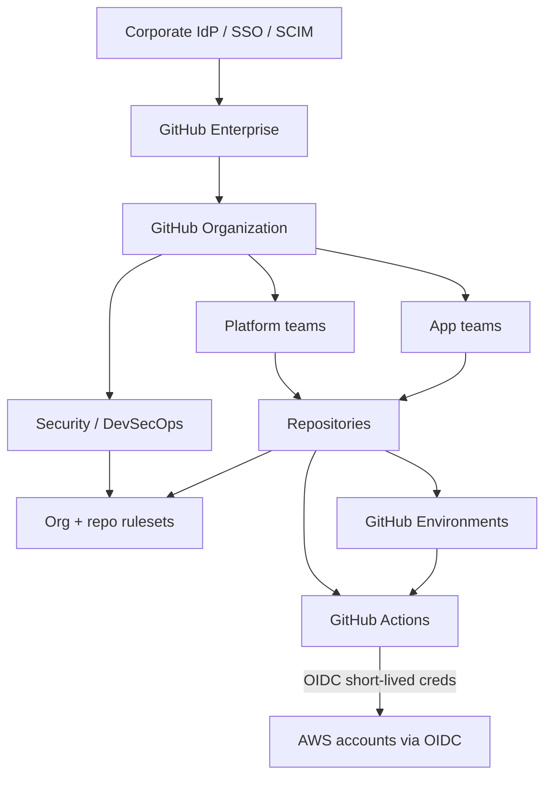

# Enterprise GitHub Governance Standards

**Audience:** GitHub Admins, Cloud COE, DevSecOps, CloudOps/SRE, Security, Compliance, App Tech Leads, CAB  
**Platform:** GitHub Enterprise Cloud (recommended) + GitHub Actions  
**Delivery target:** AWS workloads from this Terraform library (`modules` → `compositions` → `blueprints` → `environments`)  
**Companion docs:** [ENTERPRISE_CLOUD_GOVERNANCE.md](./ENTERPRISE_CLOUD_GOVERNANCE.md) · [CLOUDOPS_DEVSECOPS_ROLES_AND_KICKSTART.md](./CLOUDOPS_DEVSECOPS_ROLES_AND_KICKSTART.md)  
**Last updated:** 2026-08-17  

---

## 1. Purpose and outcomes

This document is the **enterprise source of truth for GitHub**: how the organization is structured, who may change what, how code reaches AWS, and which controls are mandatory.

It expands the GitHub/Actions sections of [ENTERPRISE_CLOUD_GOVERNANCE.md](./ENTERPRISE_CLOUD_GOVERNANCE.md) into a full operating standard.

After following it, the organization should have:

1. A governed **GitHub Enterprise → Organization → Team → Repository** model  
2. **SSO + least-privilege access** (no standing org-owner daily use)  
3. **Rulesets, CODEOWNERS, and Environments** that protect `main` and production  
4. **GitHub Actions** that authenticate to AWS with **OIDC only** (no long-lived access keys)  
5. **Supply-chain controls** (pinned actions, secret scanning, allowed-actions policy)  
6. A repeatable **repo lifecycle** (request → create → operate → archive)  
7. **Audit evidence** for every production change  

### Related repo docs

| Doc | Use when |
|-----|----------|
| [ENTERPRISE_CLOUD_GOVERNANCE.md](./ENTERPRISE_CLOUD_GOVERNANCE.md) | AWS landing zone, teams, guardrails, from-scratch cloud program |
| [CLOUDOPS_DEVSECOPS_ROLES_AND_KICKSTART.md](./CLOUDOPS_DEVSECOPS_ROLES_AND_KICKSTART.md) | Who owns pipeline security vs day-2 operations |
| [TERRAFORM_STRUCTURE_AND_USAGE.md](./TERRAFORM_STRUCTURE_AND_USAGE.md) | Root vs env tfvars; what App teams may change |
| [REUSABLE_MODULES_GUIDE.md](./REUSABLE_MODULES_GUIDE.md) | Module catalog and versioning |
| [SERVICENOW_AWS_ACCOUNT_PROVISIONING.md](./SERVICENOW_AWS_ACCOUNT_PROVISIONING.md) | Ticket → approved AWS account (often a prod-apply prerequisite) |
| [Guide/README.md](../Guide/README.md) | Maintainer rules when catalogs change |
| Actions starter | `terraform/pipelines/terraform/github-actions-blueprint.yml` |

---

## 2. Governance vision (one picture)

```
                         ┌─────────────────────────────────────────┐
                         │     ENTERPRISE GITHUB GOVERNANCE        │
                         │  Identity · Repos · Rules · Actions     │
                         └───────────────────┬─────────────────────┘
                                             │
     ┌───────────────────────────────────────┼───────────────────────────────────────┐
     ▼                                       ▼                                       ▼
┌──────────────┐                   ┌──────────────────┐                   ┌──────────────────┐
│ PEOPLE       │                   │ PLATFORM (GitHub)│                   │ DELIVERY (CI/CD) │
│ SSO / Teams  │                   │ Orgs / Repos     │                   │ Actions + OIDC   │
│ CODEOWNERS   │                   │ Rulesets / GHAS  │                   │ Plan → Approve   │
│ Approvers    │                   │ Runners          │                   │ Apply to AWS     │
└──────┬───────┘                   └────────┬─────────┘                   └────────┬─────────┘
       │                                    │                                      │
       └────────────────────────────────────┴──────────────────────────────────────┘
                                            │
                                            ▼
                              Safe, attributable change
                              (PR → scan → plan → apply)
```



---

## 3. Scope and non-negotiable principles

### 3.1 In scope

- GitHub Enterprise and Organization settings  
- Identity (SAML/OIDC SSO, SCIM, teams, PATs, GitHub Apps)  
- Repository standards, visibility, and lifecycle  
- Branching, rulesets, reviews, CODEOWNERS  
- GitHub Actions, Environments, reusable workflows, runners  
- Secrets, variables, OIDC to AWS  
- Secret scanning, push protection, Dependabot, code scanning  
- Audit logging, metrics, exceptions  

### 3.2 Out of scope (owned elsewhere)

| Topic | Owner document |
|-------|----------------|
| AWS account / OU / SCP design | [ENTERPRISE_CLOUD_GOVERNANCE.md](./ENTERPRISE_CLOUD_GOVERNANCE.md) |
| ServiceNow account vending | [SERVICENOW_AWS_ACCOUNT_PROVISIONING.md](./SERVICENOW_AWS_ACCOUNT_PROVISIONING.md) |
| Terraform module catalog | [REUSABLE_MODULES_GUIDE.md](./REUSABLE_MODULES_GUIDE.md) |

### 3.3 Principles (do not weaken without CAB)

| # | Principle | Meaning |
|---|-----------|---------|
| 1 | **Identity first** | Humans authenticate via corporate SSO. No local GitHub passwords as the primary path. |
| 2 | **Least privilege** | Org base permission is **No permission**. Access is via teams, not ad-hoc collaborators. |
| 3 | **Private by default** | Repos are private (or internal for inner-source). Public requires CAB + Security. |
| 4 | **No direct push to protected branches** | All change to `main` is a pull request. |
| 5 | **Plan before apply** | Infrastructure PRs produce a Terraform plan; apply is gated by environment. |
| 6 | **OIDC only** | GitHub Actions must not store long-lived AWS access keys. |
| 7 | **Pin the supply chain** | Third-party Actions are SHA-pinned (or org-allowlisted verified actions). |
| 8 | **Prod is dual-controlled** | Production apply requires GitHub Environment reviewers **and** change record where mandated. |
| 9 | **Evidence retained** | Plans, scan reports, and workflow logs are retained per retention policy. |
| 10 | **Break-glass is rare and reviewed** | Bypass of rulesets is a named team, time-boxed, and audited. |

---

## 4. Teams, roles, and RACI

Legend: **A** = Accountable · **R** = Responsible · **C** = Consulted · **I** = Informed

### 4.1 Named GitHub roles

| Role | Typical home team | Critical duties |
|------|-------------------|-----------------|
| **GitHub Enterprise Owner** | IT / DevEx (few people) | Enterprise policies, billing, SSO, EMU (if used) |
| **GitHub Organization Owner** | GitHub Admin (few people) | Org settings, rulesets, Actions policy, team structure |
| **GitHub Admin (platform)** | DevEx / COE | Repos, runners, reusable workflows, support |
| **Pipeline Owner** | COE + DevSecOps | Workflow design, OIDC roles, promotion path |
| **DevSecOps Lead** | DevSecOps | Gates, GHAS, allowed-actions, secret scanning |
| **CloudOps Lead** | CloudOps / SRE | Apply ops, runner capacity (self-hosted), failed deploys |
| **Repo Admin (app)** | App Tech Lead | Day-to-day repo settings **within** org policy |
| **CODEOWNER teams** | COE / Security / App | Required reviews on owned paths |
| **Environment Approver** | COE / CloudOps / CAB delegate | Approve `test` / `prod` deploys |
| **Compliance / GRC** | GRC | Evidence, retention, audit packages |

Org Owner and Enterprise Owner seats are **break-glass administrative identities**, not daily engineering roles.

### 4.2 RACI

| Activity | CAB | GitHub Admin | COE | DevSecOps | CloudOps | Security | App | Compliance |
|----------|-----|--------------|-----|-----------|----------|----------|-----|------------|
| GitHub Enterprise policy | A | R | C | C | I | C | I | C |
| Org SSO / SCIM / 2FA | I | R | I | C | I | A | I | C |
| Org structure / teams | I | A/R | C | C | I | C | C | I |
| Org rulesets | I | R | C | A | C | C | I | C |
| Repo create / archive | I | R | C | C | I | I | C | I |
| CODEOWNERS design | I | C | A | C | I | C | R (app paths) | I |
| Reusable workflows | I | R | A | R | C | C | I | I |
| Actions allow list | I | R | C | A | I | C | I | I |
| OIDC IAM trust | I | C | R | A | C | C | I | I |
| Environment approvers | I | C | A | C | R | I | C | I |
| Secret scanning / push protection | I | R | I | A | I | C | I | C |
| Runner fleet (self-hosted) | I | C | C | C | A/R | C | I | I |
| Prod apply | A (change) | I | C | C | R | I | R (request) | I |
| Audit evidence | I | C | C | C | C | C | I | A/R |

### 4.3 Access model (who gets what)

| Identity | GitHub access | Typical AWS access |
|----------|---------------|--------------------|
| App engineer | Team write on app repo; read on module library | SSO ReadOnly / limited nonprod |
| App Tech Lead | Maintain on app repo (not org owner) | Nonprod PowerUser via SSO |
| COE platform engineer | Write/maintain on platform repos | PlatformOps via SSO + OIDC roles for pipelines |
| DevSecOps | Maintain on `.github/` and security configs | Read + security tooling accounts |
| CloudOps | Write on ops runbook repos; Environment approver | PlatformOps / break-glass procedure |
| GitHub Org Owner | Org admin (named, MFA, reviewed quarterly) | None required |
| Outside collaborator | **Forbidden** unless CAB exception | N/A |

---

## 5. Target topology

### 5.1 Recommended enterprise layout

Start simple; split only when scale or blast-radius requires it.

```
GitHub Enterprise  (SSO, audit log, policies)
 └── Organization: cloud-platform   ← start here (this repo lives here)
      ├── Team: github-admins
      ├── Team: cloud-coe
      ├── Team: devsecops
      ├── Team: cloudops
      ├── Team: app-<name>
      └── Repos:
           ├── aws-modules              (this library)
           ├── aws-landing-zone         (CT / AFT / org policies — later)
           ├── github-platform          (org reusable workflows / actions)
           └── app-<name>-infra         (calls modules by git tag)

Later (optional extra orgs)
 └── Organization: applications     (product code)
 └── Organization: sandbox          (time-boxed experiments)
```

| Decision | Standard |
|----------|----------|
| Product | **GitHub Enterprise Cloud** (SAML, SCIM, internal repos, enterprise audit log, GHAS) |
| Starting org count | **One** platform organization |
| Extra orgs | Add only for hard isolation (M&A, regulated ring-fence, public OSS) |
| Visibility | Private default; **Internal** for inner-source libraries; Public = exception |
| Nested teams | Yes — IdP group → parent team → child app teams |

### 5.2 Repository taxonomy

| Class | Examples | Who writes | Versioning |
|-------|----------|------------|------------|
| **Platform library** | `aws-modules` | COE | Semver git tags (`v1.4.0`) |
| **Landing zone** | `aws-landing-zone` | COE | Tags + change tickets |
| **CI platform** | `github-platform` (reusable workflows) | GitHub Admin + DevSecOps | Tags; apps pin SHA or tag |
| **App infrastructure** | `app-payments-infra` | App team; COE reviews modules/prod | Env tfvars on branches/PRs |
| **Application** | product services | App team | Team standard |
| **Sandbox** | `exp-*` | Requester | Auto-archive after 90 days |

### 5.3 Naming conventions

| Object | Pattern | Example |
|--------|---------|---------|
| Organization | `kebab-case`, stable | `cloud-platform` |
| Team | `kebab-case`, maps to IdP | `cloud-coe`, `app-payments` |
| Platform repo | `<domain>-<purpose>` | `aws-modules`, `github-platform` |
| App infra repo | `app-<name>-infra` | `app-payments-infra` |
| Branch | `main` (default); `feature/<ticket>-<slug>` | `feature/CHG0123-add-s3` |
| Tag (modules) | `vMAJOR.MINOR.PATCH` | `v1.2.0` |
| GitHub Environment | `dev` · `test` · `prod` | match AWS env names |
| Workflow name | `kebab-case` purpose | `terraform-blueprint` |

Do not use `master` for new repos. Do not put environment names in module source — environments are `environments/<env>/*.tfvars` only.

---

## 6. Identity and access — step-by-step

### Prerequisites

- Corporate IdP (Entra ID, Okta, Ping, etc.) with groups for COE, DevSecOps, CloudOps, each app  
- Named Enterprise Owners (minimum 2, maximum small)  
- Decision: standard SAML SSO **or** Enterprise Managed Users (EMU) if the enterprise must own all user accounts  

### Process

1. **Enable SAML SSO** (or EMU) on the Enterprise; require SSO for organization membership.  
2. **Enable SCIM** so joiners/movers/leavers sync from IdP groups to GitHub teams.  
3. **Require 2FA** at Enterprise/Organization (defense in depth even with SSO).  
4. Set organization **base permissions = No permission**.  
5. Create teams that **mirror IdP groups**; grant repo roles on teams, never on individuals except break-glass.  
6. Disable or restrict **Outside collaborators**.  
7. Restrict **personal access tokens**:
   - Prefer **GitHub Apps** or SSO-aware fine-grained PATs  
   - Require admin approval for new PATs  
   - Expire tokens (90 days or less)  
   - Block classic PATs if the enterprise setting allows  
8. Ban committing secrets; enable **secret scanning + push protection** org-wide.  
9. Quarterly **access review**: Org Owners, billing managers, Environment approvers, PAT inventory.

### Exit criteria

- Humans cannot use GitHub without SSO  
- New hire with the right IdP group gets repo access without a GitHub Admin ticket (SCIM)  
- Leaver loses GitHub access when IdP account is disabled  
- Zero standing AWS keys in GitHub; zero org-wide write for all members  

References:

- [SAML SSO](https://docs.github.com/en/enterprise-cloud@latest/admin/identity-and-access-management/using-saml-for-enterprise-iam/about-saml-for-enterprise-iam)  
- [SCIM](https://docs.github.com/en/enterprise-cloud@latest/admin/identity-and-access-management/using-saml-for-enterprise-iam/configuring-scim-provisioning-for-enterprises)  
- [EMU](https://docs.github.com/en/enterprise-cloud@latest/admin/identity-and-access-management/using-enterprise-managed-users-for-iam/about-enterprise-managed-users)  

---

## 7. Organization policy baseline

Apply these at **Organization** (and Enterprise where the control exists). Repo settings must not weaken them.

| Control | Required setting |
|---------|------------------|
| Default repo visibility | Private |
| Default branch | `main` |
| Member privileges — repo creation | Restricted to GitHub Admin + COE (or via ServiceNow intake) |
| Member privileges — pages / projects | Restrict as needed; Pages public sites need review |
| Actions — policy | Allow GitHub-owned + **allowlisted** actions (see §13) |
| Actions — fork PRs from forks | Do not run privileged workflows on untrusted forks |
| Rulesets | Org ruleset on `main` and `release/*` (see §8) |
| Secret scanning | Enabled |
| Push protection | Enabled |
| Dependabot alerts | Enabled |
| Dependabot security updates | Enabled for application repos; controlled for IaC |
| Code scanning | Enabled where GHAS is licensed |
| Default merge | Squash (recommended) or merge commit; **no** accidental force-push |
| Discussions / Issues | Allowed; do not store secrets or prod data |

---

## 8. Branching, rulesets, and reviews

### 8.1 Branching model (platform and infra repos)

```
 feature/<ticket>-<slug>   ──PR──►  main
                                      │
                                      ├─ auto: validate + scan + plan(dev)
                                      ├─ merge to main
                                      ├─ apply(dev)     [auto or 1 approver]
                                      ├─ apply(test)    [Environment reviewers]
                                      └─ apply(prod)    [Environment + change ticket]
```

| Rule | Standard |
|------|----------|
| Long-lived branches | `main` only (plus `release/*` if a product requires it) |
| Hotfix | Branch from `main`, PR, expedite reviewers — still no direct push |
| Environment branches (`dev`/`prod` git branches) | **Not used** for this Terraform library; env = tfvars + GitHub Environment |

### 8.2 Organization ruleset for `main` (minimum)

Create an **organization ruleset** (not only classic branch protection) targeting default branches:

| Rule | Value |
|------|-------|
| Restrict creations / deletions / updates | On for `main` |
| Require a pull request | Yes |
| Required approvals | **2** for platform repos (`aws-modules`, landing zone, workflows); **1** for app infra (plus CODEOWNERS) |
| Dismiss stale reviews | Yes |
| Require review from CODEOWNERS | Yes |
| Require status checks to pass | Yes — `fmt`, `validate`, security scan, `plan` where applicable |
| Require conversation resolution | Yes |
| Block force pushes | Yes |
| Block deletions | Yes |
| Require linear history | Optional (on if squash-only) |
| Require signed commits | Optional — **on** if Compliance mandates it |
| Bypass actors | Only team `github-breakglass`; not individual users |

Repo-level rulesets may be **stricter**, never weaker, than the org ruleset.

### 8.3 CODEOWNERS (required in every governed repo)

Place `.github/CODEOWNERS` on `main`. Example for this library:

```
# Platform / CI — DevSecOps + GitHub Admin
.github/                    @<org>/devsecops @<org>/github-admins
/.github/workflows/         @<org>/devsecops @<org>/github-admins

# Module library — Cloud COE
/terraform/modules/         @<org>/cloud-coe
/terraform/compositions/    @<org>/cloud-coe
/terraform/blueprints/      @<org>/cloud-coe
/terraform/pipelines/       @<org>/cloud-coe @<org>/devsecops

# Env values — app team + COE for prod paths
/terraform/environments/prod/   @<org>/cloud-coe @<org>/cloudops
/terraform/environments/        @<org>/cloud-coe

# Docs that define operating model
/docs/ENTERPRISE_*.md       @<org>/cloud-coe
/Guide/                     @<org>/cloud-coe
```

Replace `@<org>/...` with real team slugs. CODEOWNERS teams must have write access or reviews will be optional.

### 8.4 Pull request standard

Every PR must include:

1. Purpose (why) and linked ticket / change ID when required  
2. What layer changed (`modules` / `compositions` / `blueprints` / `environments`)  
3. Risk and rollback (especially for `modules/` and workflows)  
4. Passing required checks  
5. No secrets, no account numbers in commit messages if policy forbids it  

**Reviewer duty:** reject PRs that edit `modules/` and prod tfvars in the same change unless the program explicitly allows a coupled release.

---

## 9. GitHub Environments and promotion

Create Environments on every repo that deploys: **`dev`**, **`test`**, **`prod`**.

| Environment | Wait timer | Required reviewers | Deployment branches | Extra |
|-------------|------------|--------------------|---------------------|--------|
| `dev` | 0 | Optional (0–1) | `main` or workflow_dispatch from `main` | Lowest-privilege OIDC role |
| `test` | Optional | **≥ 1** platform or CloudOps | `main` | Separate AWS account / role |
| `prod` | Optional change window | **≥ 2** (COE/CloudOps; CAB delegate as needed) | `main` only | Separate prod OIDC role; ServiceNow change ID input when mandated |

Secrets and variables are **per environment** (`AWS_DEPLOY_ROLE_ARN`, `AWS_REGION`). Do not share the prod role ARN with `dev`.

Promotion path (same as cloud governance Phase 6):

```
 PR to main
   │
   ├─ plan(dev)   ── auto
   ├─ apply(dev)  ── auto or 1 approval
   ├─ plan(test)  ── on merge / tag
   ├─ apply(test) ── environment approval
   ├─ plan(prod)
   └─ apply(prod) ── Environment reviewers + change ticket
```

---

## 10. GitHub Actions governance

### 10.1 Pipeline standard (infrastructure)

Minimum stages for Terraform (this repo already sketches this in `terraform/pipelines/terraform/`):

| Stage | When | Owner of gate |
|-------|------|----------------|
| `fmt -check` | Every PR | COE |
| `init` + `validate` | Every PR | COE |
| `tflint` | Every PR | COE + DevSecOps |
| Checkov / tfsec / OPA/Conftest | Every PR; **block on critical** | DevSecOps |
| Secret scan | Push + PR | DevSecOps |
| `terraform plan` | PR + before apply | DevSecOps enables; CloudOps watches |
| Manual approval | `test` / `prod` | Environment reviewers |
| `terraform apply` | After approval, using the saved plan file | CloudOps accountable for outcome |

App teams consume **reusable workflows** from `github-platform`; they do not copy-paste privileged deploy YAML into every repo.

### 10.2 Workflow hardening (mandatory)

| Control | Requirement |
|---------|-------------|
| `permissions:` | Explicit least privilege; default `contents: read`. Add `id-token: write` only for OIDC jobs. |
| `GITHUB_TOKEN` | Never `write-all`. Restrict persist-credentials on checkout if not needed. |
| Third-party actions | Pin to **full commit SHA**; tags like `@v4` are not sufficient for prod |
| `pull_request_target` | **Forbidden** unless DevSecOps-reviewed pattern (secrets + untrusted PR code) |
| `workflow_dispatch` on prod | Allowed only with Environment protection |
| Self-modification | Changes to `.github/workflows/` require DevSecOps CODEOWNERS |
| Concurrency | Use `concurrency:` groups to prevent overlapping applies on the same state |
| Plan artifact | Upload `tfplan` (or encrypted artifact) and apply **that** plan — do not re-plan at apply without review |
| Forks | Do not checkout and execute untrusted workflow files with org secrets |

### 10.3 Allowed Actions policy (organization)

Set **Allow select actions** (not “all actions”):

1. All GitHub-owned actions (`actions/*`)  
2. Verified creators as approved by DevSecOps  
3. Explicit allowlist, for example:
   - `hashicorp/setup-terraform@<sha>`  
   - `aws-actions/configure-aws-credentials@<sha>`  
4. Org-local actions: `<org>/github-platform@<sha-or-tag>`  

Review the allowlist quarterly.

### 10.4 Reusable workflows (scale-out)

1. Create repo `github-platform` (private or internal).  
2. Publish reusable workflows, e.g. `terraform-plan-apply.yml`, `ghas-scan.yml`.  
3. Caller repos use `secrets: inherit` only where Environments already isolate secrets.  
4. Version with tags; breaking changes = major tag.  
5. Required workflows / ruleset required workflows may enforce scan jobs org-wide when available on the plan.

---

## 11. Machine identity — GitHub Actions to AWS (OIDC)

This is the **only** supported pattern for AWS from GitHub Actions.

### Process

1. In each AWS account (or a shared identity account with assume-role), create an **IAM OIDC identity provider** for `token.actions.githubusercontent.com`.  
2. Create **one deploy role per GitHub Environment / AWS account**, for example:
   - `github-deploy-dev`
   - `github-deploy-test`
   - `github-deploy-prod`  
3. Trust policy **must** condition on:
   - `aud` = `sts.amazonaws.com`  
   - `sub` matching **this org, this repo, and this environment** (do not use `repo:*` wildcards in prod)  
4. Store only the **role ARN** in the GitHub Environment secret `AWS_DEPLOY_ROLE_ARN` (not access keys).  
5. Workflow job:
   - `permissions: { id-token: write, contents: read }`  
   - `aws-actions/configure-aws-credentials` with `role-to-assume`  
6. Role IAM policy is least privilege for that blueprint/account (not `AdministratorAccess` in prod).  
7. CloudTrail + GitHub audit log used to prove which workflow assumed which role.

Starter workflow: `terraform/pipelines/terraform/github-actions-blueprint.yml`.

### Exit criteria

- Successful `plan` to **dev** via OIDC  
- Prod role cannot be assumed from `dev` environment or from another repo  
- Secret scanning finds **zero** `AKIA` keys in the org  

References:

- [GitHub OIDC with AWS](https://docs.github.com/en/actions/deployment/security-hardening-your-deployments/configuring-openid-connect-in-amazon-web-services)  
- [AWS IAM OIDC providers](https://docs.aws.amazon.com/IAM/latest/UserGuide/id_roles_providers_create_oidc.html)  

---

## 12. Secrets, variables, and credentials

| Kind | Where it lives | Examples |
|------|----------------|----------|
| **Environment secret** | GitHub Environment | `AWS_DEPLOY_ROLE_ARN` |
| **Environment variable** | GitHub Environment | `AWS_REGION` |
| **Org secret** | Org, limited to selected repos | Shared non-prod scanner tokens |
| **Repo secret** | Avoid if Environment secret fits | Legacy only |
| **AWS runtime secrets** | AWS Secrets Manager / SSM | DB passwords, API keys |
| **Terraform state** | S3 + lock; encrypted; separate per env | Never in Git |

**Never commit:** `.env`, `*.pem`, `credentials.json`, Terraform `*.tfstate`, AWS keys, ServiceNow passwords.

**Never put in GitHub secrets:** long-lived `AWS_ACCESS_KEY_ID` / `AWS_SECRET_ACCESS_KEY`.

Rotation: org/repo secrets inventory reviewed monthly; leaked secrets rotated **immediately** and the PAT/key revoked.

---

## 13. Supply-chain and repository security

| Control | Standard |
|---------|----------|
| Secret scanning | Org-wide on |
| Push protection | Org-wide on |
| Dependabot alerts | On |
| Dependabot version updates | Allowed for app repos; IaC providers pinned in `versions.tf` |
| Code scanning (CodeQL or equivalent) | On for application languages; IaC via Checkov/tfsec in Actions |
| Dependency review | Required on PRs that change lockfiles (app repos) |
| Private vulnerability reporting | On for any public repo |
| GitHub Advanced Security | Licensed for platform + prod application orgs |
| Copilot / AI coding tools | Enterprise policy: no public-model training on org code if the contract allows; block suggestions that look like secrets; CODEOWNERS still apply |

Malicious-PR tabletop (from DevSecOps kickstart) remains a **quarterly** exercise: untrusted PR tries public S3 / open SG → CI must fail.

---

## 14. Runners

| Option | When to use | Governance |
|--------|-------------|------------|
| **GitHub-hosted** | Default for this library and most IaC | No extra fleet; still OIDC + least privilege |
| **Self-hosted** | Data gravity, private packages, licensed tools, regulated egress | CloudOps owns uptime; DevSecOps owns hardening |

Self-hosted minimum bar:

- Ephemeral runners (or equivalent: one job, then destroy)  
- No standing org/repo secrets on disk after the job  
- Locked-down network egress  
- Labels that **cannot** be selected by untrusted workflows (`runs-on` allowlist via policy)  
- Patch cadence documented  
- Separate labels for `prod` vs `nonprod` if prod data could appear in logs  

---

## 15. Repository lifecycle — step-by-step

### 15.1 Create a new repo (governed)

1. Requester opens ServiceNow (or inner-source form): purpose, classification, owners, visibility.  
2. GitHub Admin (or automated template) creates the repo from an **org template**:
   - `main` + org ruleset applies  
   - `.github/CODEOWNERS`, `SECURITY.md`, `LICENSE` / `NOTICE` as required  
   - Default workflow from `github-platform`  
   - Environments `dev` / `test` / `prod` if it deploys  
3. Teams attached via SCIM-backed GitHub teams — not named users.  
4. If the repo deploys to AWS: OIDC role `sub` updated to include the new repo (least privilege).  
5. CMDB / catalog updated (repo URL, owner, data class).  

### 15.2 Operate

- CODEOWNERS keep reviews current  
- Dependabot/GHAS findings SLA: critical = 7 days, high = 30 days (tune with Security)  
- Module consumers pin **git tags**, not `main`  

### 15.3 Archive / transfer

- Inactive > 90 days (sandbox) or product sunset: **archive** (read-only), do not delete unless Legal says so  
- Transfers out of the enterprise require CAB + Security  
- Revoke OIDC trust for archived deploy repos the same day  

---

## 16. How this Terraform repo is governed

| Path | Change type | Reviewers | Pipeline |
|------|-------------|-----------|----------|
| `terraform/modules/**` | Library — impacts all consumers | COE (+ DevSecOps for security-sensitive modules) | PR checks; version tag after merge |
| `terraform/compositions/**` | Approved stack | COE | PR checks |
| `terraform/blueprints/**` | Golden path | COE + pilot app | Plan against env tfvars |
| `terraform/environments/dev\|test/**` | Values only | App Tech Lead; COE optional | Plan |
| `terraform/environments/prod/**` | Values only | COE + CloudOps | Plan + prod Environment |
| `terraform/pipelines/**` and `.github/workflows/**` | Delivery | DevSecOps + GitHub Admin | Workflow syntax + security review |
| `docs/**` / `Guide/**` | Operating model | COE | Docs review; catalog rules in [Guide/README.md](../Guide/README.md) |

App teams **do not** fork modules into app repos. They reference tagged module versions from `aws-modules`.

---

## 17. Developer onboarding (GitHub)

### First-day access

1. IdP group assigned (`app-<name>` or `cloud-coe`).  
2. SCIM creates GitHub user + team membership.  
3. Engineer clones **only** repos the team can see.  
4. Reads: this document, [TERRAFORM_STRUCTURE_AND_USAGE.md](./TERRAFORM_STRUCTURE_AND_USAGE.md), [Guide/README.md](../Guide/README.md).  

### First safe change (infra)

1. Branch from `main`.  
2. Change **only** `environments/<nonprod>/*.tfvars` (or docs).  
3. Open PR; wait for `fmt` / `validate` / scan / plan.  
4. Address CODEOWNERS.  
5. After merge, `dev` apply per Environment policy.  

Production tfvars and module source changes are **not** first-week work.

---

## 18. Day-2 operating procedures

| Event | First response | Owner |
|-------|----------------|-------|
| Failed PR check | Engineer fixes; DevSecOps if scanner false-positive | App / DevSecOps |
| Failed `apply` | Do not clickops. Re-run from Actions or PR a fix. Unlock state only via CloudOps procedure | CloudOps |
| Secrets in a PR | Push protection blocks; if it landed, rotate, purge history if required, incident | DevSecOps + App |
| Compromised PAT / leaked OIDC misconfig | Revoke token/role, rotate, audit CloudTrail | DevSecOps + CloudOps |
| Need to bypass ruleset | Ticket + `github-breakglass` + expiry; post-review in CAB | GitHub Admin |
| Actions outage / runner shortage | Status comms; pause prod applies | CloudOps + GitHub Admin |
| Drift detected (scheduled plan) | Ticket; PR to reconcile; no silent apply | CloudOps |

---

## 19. Exception management

| Severity | Example | Approvers | Max duration |
|----------|---------|-----------|--------------|
| Low | Extra GitHub-hosted runner label for a POC | GitHub Admin | 30 days |
| Medium | Classic PAT for a vendor integration | GitHub Admin + DevSecOps | 14 days + rotation date |
| High | Disable push protection, allow all Actions, public repo, or ruleset bypass standing access | CAB + Security + Compliance | Time-boxed + compensating controls |

Every exception records: ticket ID, risk, compensating controls, expiry, owner, and GitHub objects affected (org, repo, ruleset).

---

## 20. Metrics that prove GitHub governance works

| KPI | Starter target |
|-----|----------------|
| % of members using SSO | 100% |
| Repos missing org ruleset on `main` | 0 |
| % of prod AWS changes via GitHub Actions | ≥ 95% |
| Workflows using AWS static keys | 0 |
| Third-party actions not SHA-pinned (prod workflows) | 0 |
| Critical GHAS / secret alerts open > SLA | 0 |
| Outside collaborators | 0 (or 100% exception-registered) |
| Mean time PR open → merge (platform, non-emergency) | Track; optimize without skipping reviews |
| Break-glass ruleset bypasses / month | Tracked + reviewed in CAB |

---

## 21. From-scratch implementation (GitHub program)


### G0 — Decisions (3–5 days)

**Teams:** CAB, GitHub Admin, DevSecOps, COE, Identity, Compliance  

1. Confirm GitHub Enterprise Cloud (or document an approved exception).  
2. SSO vs EMU.  
3. One org vs many.  
4. GHAS licensing scope.  
5. Runner strategy (hosted first).  
6. Approve **this document**.  

**Exit:** Named Enterprise Owners, Org Owners, Pipeline Owner, DevSecOps Lead.

### G1 — Enterprise identity (1 week)

1. SSO + SCIM + 2FA.  
2. Create teams from IdP groups.  
3. Disable unwanted PAT/classic token paths as far as the plan allows.  

**Exit:** Pilot users join via IdP group only.

### G2 — Organization baseline (1 week)

1. Base permission none; private default.  
2. Secret scanning + push protection.  
3. Actions allow list (even if initially GitHub-owned only).  
4. Org ruleset draft on `main`.  

**Exit:** New repo inherits controls.

### G3 — Platform repo (this library)

1. Protect `main`; add CODEOWNERS.  
2. Template files: PR template, SECURITY.md.  
3. Wire `fmt` / `validate` / tflint / Checkov on pull_request.  

**Exit:** A PR that introduces an open security group **fails CI**.

### G4 — OIDC and Environments

1. GitHub Environments `dev` / `test` / `prod`.  
2. AWS OIDC provider + per-env roles.  
3. Adopt / harden `terraform/pipelines/terraform/github-actions-blueprint.yml`.  
4. First successful **dev plan + apply** with no static keys.  

**Exit:** Matches cloud governance Phase 4A exit.

### G5 — Promotion and reusable workflows

1. Extract reusable workflow to `github-platform` (or `.github/workflows` until the second repo exists).  
2. `test`/`prod` required reviewers.  
3. Prod apply requires change ID if CAB said so.  
4. Scheduled drift plan for one blueprint.  

**Exit:** Second repo or second blueprint uses the same workflow.

### G6 — Enterprise scale

1. Org templates for `app-*-infra`.  
2. Automated repo request (ServiceNow).  
3. GHAS dashboards for Security.  
4. Quarterly access and allow-list reviews.  
5. Optional self-hosted runners with the §14 bar.  

**Exit:** App team can request a repo and deploy to **dev** without a GitHub Admin building YAML by hand.

---

## 22. 90-day view (GitHub track)

| Days | Focus | Outcome |
|------|-------|---------|
| 0–15 | G0–G1 | SSO/SCIM live; owners named |
| 16–30 | G2–G3 | Org baseline + this repo rulesets/CODEOWNERS |
| 31–45 | G4 | OIDC plan/apply to **dev** |
| 46–60 | G5 | test/prod Environments + reusable workflow |
| 61–75 | GHAS + drift job + app-infra template |
| 76–90 | G6 | Second team onboarded; metrics in CAB pack |

Run in parallel with [cloud governance 90-day plan](./ENTERPRISE_CLOUD_GOVERNANCE.md) Phases 4–6.

---

## 23. Minimum control checklist (audit-ready)

- [ ] GitHub Enterprise (or approved equivalent) with SSO required  
- [ ] SCIM (or documented joiner-mover-leaver process)  
- [ ] 2FA required  
- [ ] Org base permission = No permission  
- [ ] No outside collaborators (or exception register)  
- [ ] Org ruleset on `main`: PR, reviews, no force-push  
- [ ] CODEOWNERS on platform and workflow paths  
- [ ] Environments `dev` / `test` / `prod` with prod reviewers  
- [ ] Actions → AWS via OIDC only  
- [ ] Actions allow list enabled  
- [ ] Third-party actions SHA-pinned in production workflows  
- [ ] Secret scanning + push protection on  
- [ ] Explicit `permissions:` on workflows  
- [ ] No `pull_request_target` without DevSecOps sign-off  
- [ ] Plan artifacts retained; apply uses the reviewed plan  
- [ ] Break-glass team documented and reviewed  
- [ ] Exception register exists  
- [ ] Audit log streaming to the enterprise SIEM (where licensed)  

---

## 24. Master references

### GitHub

| Topic | Link |
|-------|------|
| GitHub Actions | https://docs.github.com/en/actions |
| Security hardening for Actions | https://docs.github.com/en/actions/security-guides/security-hardening-for-github-actions |
| OIDC to AWS | https://docs.github.com/en/actions/deployment/security-hardening-your-deployments/configuring-openid-connect-in-amazon-web-services |
| Environments | https://docs.github.com/en/actions/deployment/targeting-different-environments/using-environments-for-deployment |
| Reusable workflows | https://docs.github.com/en/actions/using-workflows/reusing-workflows |
| Rulesets | https://docs.github.com/en/repositories/configuring-branches-and-merges-in-your-repository/managing-rulesets/about-rulesets |
| CODEOWNERS | https://docs.github.com/en/repositories/managing-your-repositorys-settings-and-features/customizing-your-repository/about-code-owners |
| Secret scanning | https://docs.github.com/en/code-security/secret-scanning/about-secret-scanning |
| Push protection | https://docs.github.com/en/code-security/secret-scanning/introduction/about-push-protection |
| Dependabot | https://docs.github.com/en/code-security/getting-started/dependabot-quickstart-guide |
| Enterprise IAM / SAML | https://docs.github.com/en/enterprise-cloud@latest/admin/identity-and-access-management/using-saml-for-enterprise-iam/about-saml-for-enterprise-iam |
| Audit log | https://docs.github.com/en/enterprise-cloud@latest/admin/monitoring-activity-in-your-enterprise/reviewing-audit-logs-for-your-enterprise/about-the-audit-log-for-your-enterprise |

### AWS (federation)

| Topic | Link |
|-------|------|
| IAM OIDC identity providers | https://docs.aws.amazon.com/IAM/latest/UserGuide/id_roles_providers_create_oidc.html |
| IAM best practices | https://docs.aws.amazon.com/IAM/latest/UserGuide/best-practices.html |

### This repository

| Topic | Path |
|-------|------|
| Cloud governance (parent) | [ENTERPRISE_CLOUD_GOVERNANCE.md](./ENTERPRISE_CLOUD_GOVERNANCE.md) |
| CloudOps / DevSecOps split | [CLOUDOPS_DEVSECOPS_ROLES_AND_KICKSTART.md](./CLOUDOPS_DEVSECOPS_ROLES_AND_KICKSTART.md) |
| Actions blueprint starter | `terraform/pipelines/terraform/github-actions-blueprint.yml` |
| Pipeline stages template | `terraform/pipelines/terraform/templates/pipeline-stages.yaml` |
| Structure / env model | [TERRAFORM_STRUCTURE_AND_USAGE.md](./TERRAFORM_STRUCTURE_AND_USAGE.md) |

---

## 25. Document history

| Date | Change |
|------|--------|
| 2026-08-17 | Initial enterprise GitHub governance (identity, orgs/repos, rulesets, Actions, OIDC, supply chain, lifecycle) |
