# Terraform Structure, Root Modules & Reusable Submodules

**Audience:** Platform engineers, application teams, and anyone consuming this library  
**Purpose:** Give every reader a clear mental model of **how this repo is structured**, what a **Terraform root module** vs **submodule** means, and how to create a **new environment** or **new project** without disturbing shared library code  
**Last updated:** 2026-08-06  

> **Start here for pictures:** jump to **[Section 1A](#1a-deep-dive--root-module--project--environment-read-this-first)** for full ASCII + Mermaid flow of Root Module → Project → Environment. 

Related docs:

- [REUSABLE_MODULES_GUIDE.md](./REUSABLE_MODULES_GUIDE.md) — full module inventory  
- [terraform/OPERATING_MODEL.md](../terraform/OPERATING_MODEL.md) — short operating rules  
- [Guide/README.md](../Guide/README.md) — maintainer rules  

---

## 1. What structure are we using?

This repository uses a **layered reusable-module library** (sometimes called a **“module → composition → blueprint → environment”** model).

| Layer | Folder | Role |
|-------|--------|------|
| **Library modules (submodules)** | `terraform/modules/<domain>/…` | Small reusable building blocks (VPC pieces, S3, IAM role, RDS…) |
| **Compositions** | `terraform/compositions/<domain>/…` | Approved stacks that **call** library modules |
| **Blueprints (typical Terraform root)** | `terraform/blueprints/…` | Golden-path roots where teams run `terraform init/plan/apply` |
| **Environments (values only)** | `terraform/environments/<env>/…` | `.tfvars` — CIDRs, sizes, names, tags — **no resources** |
| **Pipelines / Accounts** | `terraform/pipelines/`, `terraform/accounts/` | How/where applies are targeted |

### Important Terraform terms (literal meaning)

| Term | Meaning in Terraform | In **this** repo |
|------|----------------------|------------------|
| **Root module** | The directory where you run `terraform init / plan / apply` | Usually a **blueprint** (e.g. `blueprints/three-tier-webapp`) |
| **Child module / submodule** | Anything called with `module "x" { source = "…" }` | `modules/*` and often `compositions/*` when called from a blueprint |
| **Reusable library module** | Versioned, shared child module with no env hardcoding | Everything under `modules/<domain>/` |

> So when people say “use the root modules,” in day-to-day work they usually mean: **run Terraform from a blueprint root**, and **reuse library modules/compositions as submodules** — do **not** copy code.

---

## 1A. Deep dive — Root module ↔ Project ↔ Environment (read this first)

Many people mix up three different ideas. Keep them separate:

| Word | What it is | Example in this repo |
|------|------------|----------------------|
| **Project** | An application / product pattern you deliver | `three-tier-webapp`, `batch-compute` |
| **Root module** | Folder where you run Terraform for that project | `terraform/blueprints/three-tier-webapp/` |
| **Environment** | A set of **values** + target account (not a second copy of modules) | `environments/dev|test|prod/*.tfvars` |

### Diagram A — One project, three environments (ASCII — always visible)

```
                         ┌─────────────────────────────────────┐
                         │   PROJECT: three-tier-webapp        │
                         │   ROOT MODULE (run terraform HERE)  │
                         │   blueprints/three-tier-webapp/     │
                         │                                     │
                         │   main.tf  variables.tf  outputs.tf │
                         └───────────────┬─────────────────────┘
                                         │
           ┌─────────────────────────────┼─────────────────────────────┐
           │                             │                             │
           ▼                             ▼                             ▼
 ┌───────────────────┐         ┌───────────────────┐         ┌───────────────────┐
 │ ENVIRONMENT: DEV  │         │ ENVIRONMENT: TEST │         │ ENVIRONMENT: PROD │
 │                   │         │                   │         │                   │
 │ File (values):    │         │ File (values):    │         │ File (values):    │
 │ environments/dev/ │         │ environments/test/│         │ environments/prod/│
 │ three-tier-       │         │ three-tier-       │         │ three-tier-       │
 │   webapp.tfvars   │         │   webapp.tfvars   │         │   webapp.tfvars   │
 │                   │         │                   │         │                   │
 │ - name_prefix     │         │ - name_prefix     │         │ - name_prefix     │
 │ - vpc_cidr        │         │ - vpc_cidr        │         │ - vpc_cidr        │
 │ - instance sizes  │         │ - instance sizes  │         │ - instance sizes  │
 │ - tags.Environment│         │ - tags.Environment│         │ - tags.Environment│
 │   = "dev"         │         │   = "test"        │         │   = "prod"        │
 └─────────┬─────────┘         └─────────┬─────────┘         └─────────┬─────────┘
           │                             │                             │
           │  terraform plan/apply       │                             │
           │  -var-file=...dev/...       │  -var-file=...test/...      │  -var-file=...prod/...
           ▼                             ▼                             ▼
    ┌────────────┐                ┌────────────┐                ┌────────────┐
    │ AWS Dev    │                │ AWS Test   │                │ AWS Prod   │
    │ Account    │                │ Account    │                │ Account    │
    └────────────┘                └────────────┘                └────────────┘

 KEY POINT:
   SAME root module code  →  DIFFERENT tfvars  →  DIFFERENT AWS stacks
   You do NOT clone blueprints/ or modules/ for each environment.
```

### Diagram B — Command flow (what you type)

```
  Engineer
     │
     │  cd terraform/blueprints/three-tier-webapp     ← ROOT MODULE
     │
     ├─► terraform init
     │
     ├─► terraform plan  -var-file=../../environments/dev/three-tier-webapp.tfvars
     │                         ▲
     │                         └── ENVIRONMENT values injected into ROOT
     │
     └─► terraform apply -var-file=../../environments/dev/three-tier-webapp.tfvars
                               │
                               ▼
                    Root reads variables
                               │
                               ├── module.network   → composition → library modules
                               ├── module.app_storage
                               ├── module.app_compute
                               └── module.database
                               │
                               ▼
                           AWS Account
```

### Diagram C — Root calls compositions (project wiring)

```
 ROOT MODULE
 blueprints/three-tier-webapp/main.tf
 ┌──────────────────────────────────────────────────────────────┐
 │  module "network" {                                          │
 │    source = "../../compositions/network/network-baseline"    │──┐
 │  }                                                           │  │
 │                                                              │  │
 │  module "app_storage" {                                      │  │
 │    source = "../../compositions/storage/secure-storage"      │──┤
 │  }                                                           │  │
 │                                                              │  │
 │  module "app_compute" {                                      │  │
 │    source = "../../compositions/compute/compute-baseline"    │──┤
 │  }                                                           │  │
 │                                                              │  │
 │  module "database" {                                         │  │
 │    source = "../../compositions/database/data-tier"          │──┤
 │  }                                                           │  │
 └──────────────────────────────────────────────────────────────┘  │
                                                                   │
        ┌──────────────────────────────────────────────────────────┘
        ▼
 COMPOSITIONS (child modules)                 LIBRARY MODULES (submodules)
 ┌────────────────────────────┐               ┌─────────────────────────┐
 │ network-baseline           │──────────────►│ modules/network/*       │
 │ secure-storage             │──────────────►│ modules/security/kms-key│
 │                            │──────────────►│ modules/storage/s3-bucket│
 │ compute-baseline           │──────────────►│ modules/identity/iam-role│
 │                            │──────────────►│ modules/compute/ec2-... │
 │ data-tier                  │──────────────►│ modules/database/rds-...│
 └────────────────────────────┘               └─────────────────────────┘
```

### Diagram D — Many projects in the same repo

Each **project** has its own **root module** (blueprint). Environments are value files under that project name.

```
 terraform/
 │
 ├── blueprints/                          ← each folder = one PROJECT ROOT MODULE
 │     ├── three-tier-webapp/             ← Project A root
 │     ├── batch-compute/                 ← Project B root
 │     └── secure-data-platform/          ← Project C root
 │
 └── environments/
       ├── dev/
       │     ├── three-tier-webapp.tfvars      ← Project A @ DEV
       │     ├── batch-compute.tfvars          ← Project B @ DEV
       │     └── secure-data-platform.tfvars   ← Project C @ DEV
       ├── test/
       │     ├── three-tier-webapp.tfvars
       │     └── ...
       └── prod/
             ├── three-tier-webapp.tfvars
             └── ...


 MATRIX VIEW
 ─────────────────────────────┬──────────┬──────────┬──────────
                              │   DEV    │   TEST   │   PROD
 ─────────────────────────────┼──────────┼──────────┼──────────
 Project: three-tier-webapp   │ tfvars   │ tfvars   │ tfvars
   root: blueprints/three-... │ apply    │ apply    │ apply
 ─────────────────────────────┼──────────┼──────────┼──────────
 Project: batch-compute       │ tfvars   │ tfvars   │ tfvars
   root: blueprints/batch-... │ apply    │ apply    │ apply
 ─────────────────────────────┴──────────┴──────────┴──────────

 Shared by ALL projects / ALL envs:
   modules/*  and  compositions/*
```

### Diagram E — New ENVIRONMENT vs New PROJECT (what changes?)

```
 ADD NEW ENVIRONMENT (e.g. uat for existing three-tier-webapp)
 ────────────────────────────────────────────────────────────
 CHANGE:
   ✅ environments/uat/three-tier-webapp.tfvars   (new values file)
   ✅ accounts map / pipeline target (if new AWS account)
 DO NOT CHANGE:
   ❌ blueprints/three-tier-webapp/*   (root stays same)
   ❌ compositions/*
   ❌ modules/*

 ADD NEW PROJECT (e.g. payments-platform)
 ────────────────────────────────────────────────────────────
 CHANGE:
   ✅ blueprints/payments-platform/*     (NEW root module)
   ✅ environments/dev|test|prod/payments-platform.tfvars
 MAY CHANGE (only if needed):
   ◐ compositions/<domain>/...           (if new stack wiring)
   ◐ modules/<domain>/...                (if new reusable primitive)
 DO NOT:
   ❌ Copy modules into the project folder
   ❌ Duplicate VPC/S3 code for payments only
```

### Diagram F — Full left-to-right path (project + env together)

```
 ┌──────────┐    selects     ┌────────────────────┐    runs in     ┌─────────────────────────┐
 │ Human /  │ ─────────────► │ Environment values │ ─────────────► │ ROOT MODULE (Project)   │
 │ Pipeline │                │ *.tfvars           │  -var-file=    │ blueprints/<project>/   │
 └──────────┘                └────────────────────┘                └───────────┬─────────────┘
                                                                               │
                                                                               │ module "..." {
                                                                               │   source = compositions/...
                                                                               │ }
                                                                               ▼
                                                                   ┌─────────────────────────┐
                                                                   │ COMPOSITION             │
                                                                   │ (approved stack)        │
                                                                   └───────────┬─────────────┘
                                                                               │
                                                                               │ module "..." {
                                                                               │   source = modules/domain/...
                                                                               │ }
                                                                               ▼
                                                                   ┌─────────────────────────┐
                                                                   │ LIBRARY SUBMODULE       │
                                                                   │ creates AWS resources   │
                                                                   └───────────┬─────────────┘
                                                                               │
                                                                               ▼
                                                                   ┌─────────────────────────┐
                                                                   │ AWS Account for that    │
                                                                   │ Environment             │
                                                                   └─────────────────────────┘
```

### Mermaid — Root × Project × Environment (renders on GitHub)

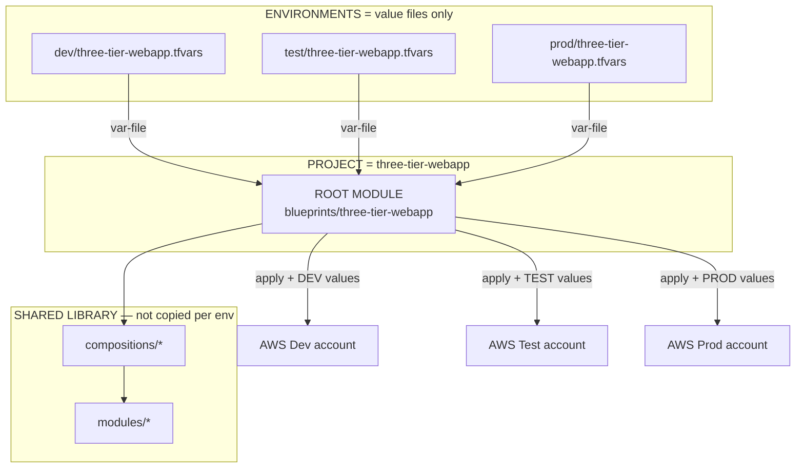

### Mermaid — Inside one apply (who calls whom)

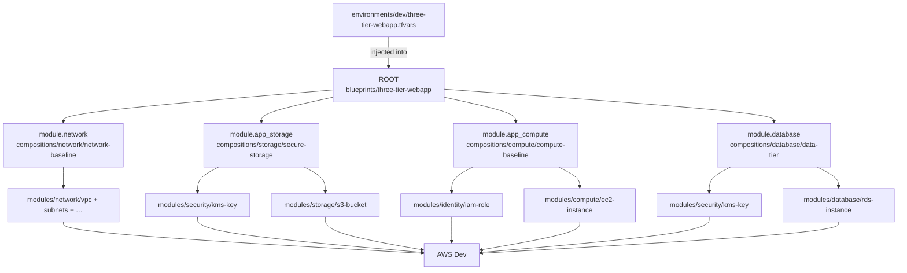

> **Viewer tip:** ASCII diagrams above work in any editor. Mermaid diagrams render on **GitHub** and many Markdown previews. If Mermaid does not draw in your local preview, use Diagrams A–F.

---

## 2. Big-picture flow (easy view)

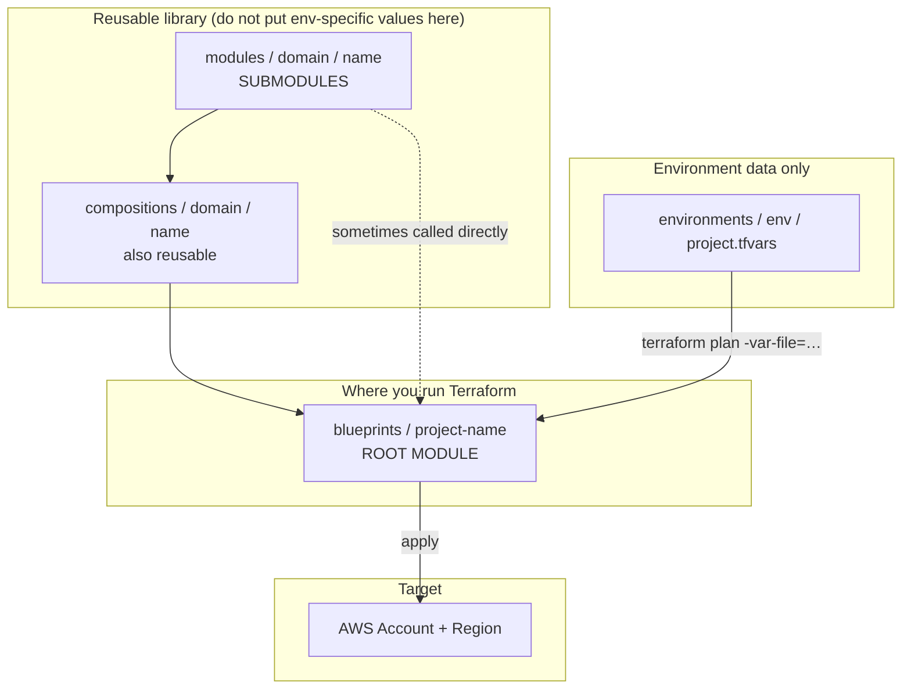

### Same idea as a tree

```
terraform/
├── modules/                 ← Reusable SUBMODULES (library)
│   ├── network/
│   ├── identity/
│   ├── security/
│   ├── observability/
│   ├── compute/
│   ├── storage/
│   └── database/
├── compositions/            ← Reusable stacks (call modules)
│   ├── network/
│   ├── compute/
│   ├── storage/
│   ├── database/
│   └── observability/
├── blueprints/              ← Typical ROOT MODULES (run terraform here)
│   ├── three-tier-webapp/
│   ├── batch-compute/
│   └── secure-data-platform/
├── environments/            ← Values only (NOT a root module)
│   ├── shared/
│   ├── dev/
│   ├── test/
│   └── prod/
├── pipelines/
└── accounts/
```

---

## 3. Why reusable library modules help

| Benefit | What it means day-to-day |
|---------|---------------------------|
| **Build once, reuse many times** | One `storage/s3-bucket` powers many projects/envs |
| **Consistent security** | Guardrails (encryption, tagging, BPA…) live in one place |
| **Faster new projects** | Wire compositions/blueprints instead of rewriting AWS resources |
| **Safer environments** | `dev` / `test` / `prod` differ by **tfvars**, not by forked module code |
| **Easier reviews** | PRs change a shared module once; all consumers benefit |
| **Clear ownership** | Cloud COE owns `modules/` + `compositions/`; teams own tfvars + project blueprints |

### What reusable modules are **not**

- Not a place to hardcode `dev` bucket names or prod instance sizes  
- Not something you copy into every project folder  
- Not where you run `terraform apply` for day-1 app delivery (prefer a blueprint root)

---

## 4. Root module vs submodule (how calling works)

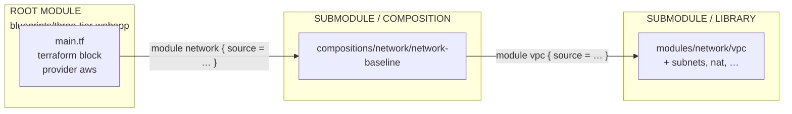

### Example calling chain

1. **Root:** `blueprints/three-tier-webapp/main.tf`

```hcl
module "network" {
  source = "../../compositions/network/network-baseline"
  # inputs from variables / tfvars
}
```

2. **Composition (child):** calls library modules

```hcl
module "vpc" {
  source = "../../../modules/network/vpc"
  # …
}
```

3. **Library module (grandchild submodule):** creates AWS resources  

You run commands **only at the root**:

```bash
cd terraform/blueprints/three-tier-webapp
terraform init
terraform plan  -var-file=../../environments/dev/three-tier-webapp.tfvars
terraform apply -var-file=../../environments/dev/three-tier-webapp.tfvars
```

---

## 5. Domain layout inside `modules/` (submodules)

We group library modules by **domain** (capability area), not by environment.

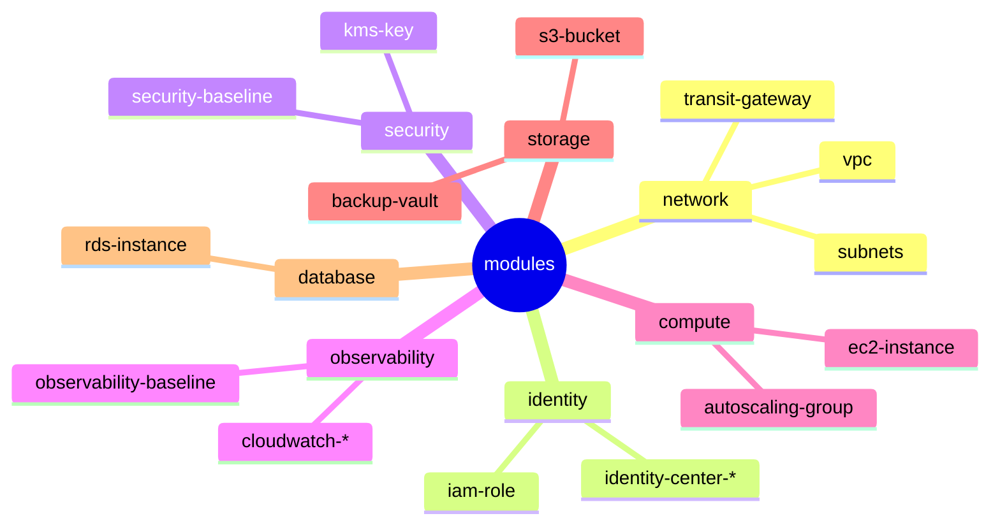

Each leaf module typically contains:

```
modules/<domain>/<module-name>/
├── main.tf        # resources / nested module calls
├── variables.tf   # inputs
├── outputs.tf     # outputs for parents
└── versions.tf    # terraform + provider constraints
```

Legacy folders at `modules/s3`, `modules/ec2`, etc. are **shims only** — prefer domain paths (`modules/storage/s3-bucket`, …).

---

## 6. Compositions = reusable stacks of submodules

Compositions are still **child modules** when used from a blueprint. They encode COE-approved wiring.

| Composition example | Calls (conceptually) |
|---------------------|----------------------|
| `compositions/storage/secure-storage` | `security/kms-key` + `storage/s3-bucket` |
| `compositions/database/data-tier` | `security/kms-key` + `database/rds-instance` |
| `compositions/compute/compute-baseline` | `identity/iam-role` + `compute/ec2-instance` |
| `compositions/network/network-foundation` | vpc + subnets + igw + nat + routes + … |

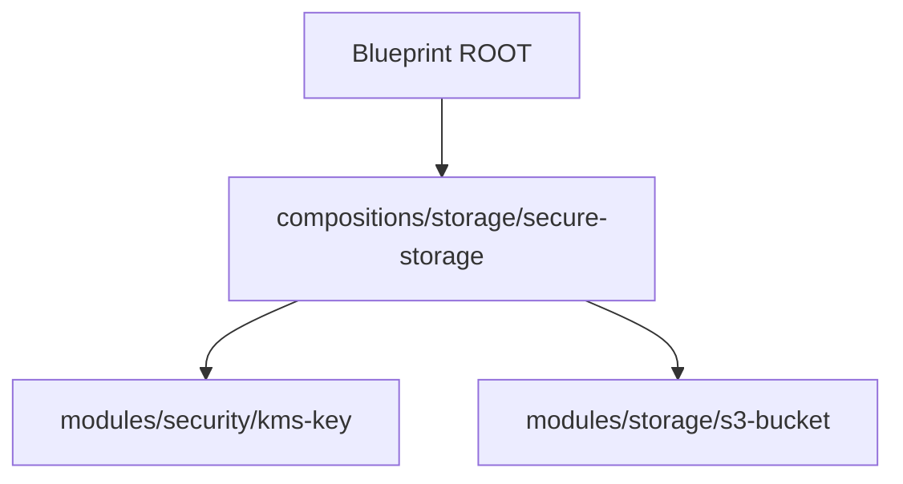

---

## 7. How to create a **new environment** (without touching library code)

**Goal:** Add `uat` (example) for an **existing** blueprint.

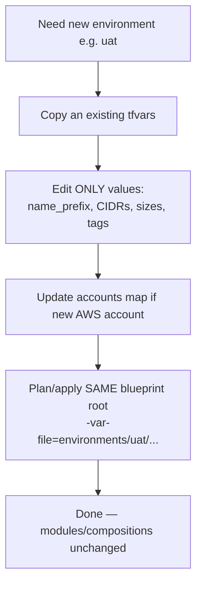

### Step-by-step

1. Create folder: `terraform/environments/uat/`  
2. Copy: `environments/dev/three-tier-webapp.tfvars` → `environments/uat/three-tier-webapp.tfvars`  
3. Change **values only**, for example:

```hcl
name_prefix = "demo-uat"
vpc_cidr    = "10.40.0.0/16"
# …
tags = {
  Environment = "uat"
  ManagedBy   = "terraform"
  Owner       = "cloud-coe"
}
```

4. If UAT uses a different AWS account, update `terraform/accounts/account-map.yaml` (or pipeline target).  
5. Run from the **same root blueprint**:

```bash
cd terraform/blueprints/three-tier-webapp
terraform plan -var-file=../../environments/uat/three-tier-webapp.tfvars
```

### Do / Don’t

| Do | Don’t |
|----|--------|
| Add/change `environments/<env>/*.tfvars` | Hardcode `uat` inside `modules/` |
| Use separate state per env/account | Share one state file across prod + nonprod |
| Promote via Git + pipeline | Copy entire `modules/` tree into the env folder |

---

## 8. How to create a **new project** (new blueprint / golden path)

**Goal:** Deliver a new application pattern that is not covered by existing blueprints.

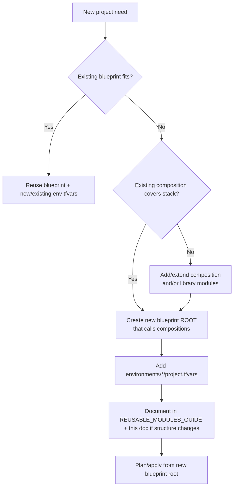

### Step-by-step (recommended)

1. **Search first** — can `three-tier-webapp`, `batch-compute`, or `secure-data-platform` work?  
2. If yes → only add/adjust **environment tfvars**.  
3. If no → create:

```
terraform/blueprints/<your-project>/
├── main.tf          # ROOT: call compositions
├── variables.tf
├── outputs.tf
└── versions.tf      # optional if provider pinned in main
```

4. In `main.tf`, prefer compositions:

```hcl
module "network" {
  source = "../../compositions/network/network-baseline"
  # …
}

module "storage" {
  source = "../../compositions/storage/secure-storage"
  # …
}
```

5. Add tfvars:

```
terraform/environments/dev/<your-project>.tfvars
terraform/environments/test/<your-project>.tfvars
terraform/environments/prod/<your-project>.tfvars
```

6. Apply from the new **root**:

```bash
cd terraform/blueprints/<your-project>
terraform init
terraform plan -var-file=../../environments/dev/<your-project>.tfvars
```

7. Update catalogs / guides when you add public compositions or modules ([Guide rules](../Guide/README.md)).

### When to add a new **library submodule**

Add under `modules/<domain>/<name>/` only if:

- The resource pattern will be reused by multiple compositions/projects, and  
- Guardrails belong in the shared library  

Otherwise keep logic in a composition or blueprint temporarily, then promote later.

---

## 9. End-to-end delivery flow (project + environments)

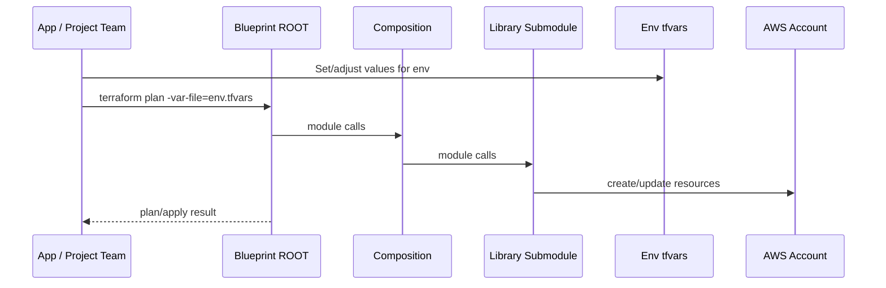

### Promotion model

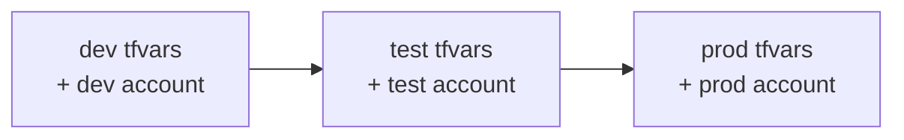

- **Code** (modules/compositions/blueprints) promotes via Git PR.  
- **Config** (tfvars) promotes by applying the same root with the next env file.  
- Never “promote” by editing module defaults to look like prod.

---

## 10. Where state and backends live (conceptual)

Blueprints are roots → **each env/account typically needs its own state key**.

| Item | Guidance |
|------|----------|
| State | Remote backend (S3 + DynamoDB lock, or org standard) |
| Key pattern example | `env/dev/three-tier-webapp/terraform.tfstate` |
| Workspace vs separate keys | Prefer separate keys/backends per env for clarity |
| Who configures backend | Pipelines / platform — not inside reusable library modules |

Library modules themselves should **not** define backends.

---

## 11. Decision tree (print this)

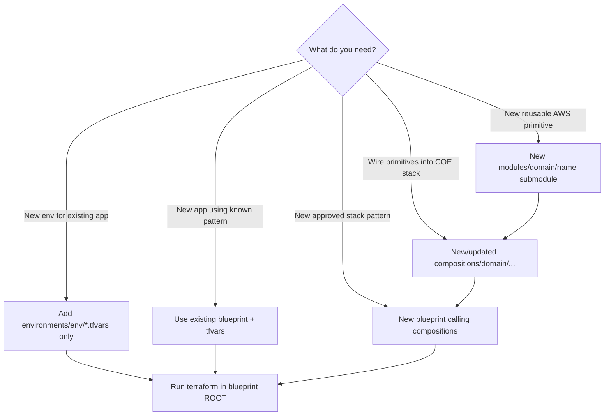

---

## 12. Quick examples for this repo

### A) New environment for three-tier webapp

```bash
# 1) create tfvars
cp terraform/environments/dev/three-tier-webapp.tfvars \
   terraform/environments/uat/three-tier-webapp.tfvars

# 2) edit values in uat tfvars
# 3) plan from ROOT
cd terraform/blueprints/three-tier-webapp
terraform plan -var-file=../../environments/uat/three-tier-webapp.tfvars
```

### B) Consume a library submodule from a composition

```hcl
module "bucket" {
  source = "../../../modules/storage/s3-bucket"
  # variables…
}
```

### C) Consume a composition from a blueprint root

```hcl
module "app_storage" {
  source = "../../compositions/storage/secure-storage"
  # variables from root variables.tf / tfvars
}
```

---

## 13. Structure checklist for reviews

When reviewing a PR, ask:

1. Did we put env-specific values in **tfvars** (good) or inside **modules** (bad)?  
2. Is the directory where people `apply` a **blueprint root** (good)?  
3. Are new shared primitives under `modules/<domain>/` with `main/variables/outputs/versions`?  
4. Prefer composition over raw resources in blueprints when a composition exists?  
5. Were catalogs/guides updated if modules/compositions changed?

---

## 14. Related documents

| Doc | Purpose |
|-----|---------|
| [REUSABLE_MODULES_GUIDE.md](./REUSABLE_MODULES_GUIDE.md) | Inventory of all modules + reuse rules |
| [SERVICENOW_AWS_ACCOUNT_PROVISIONING.md](./SERVICENOW_AWS_ACCOUNT_PROVISIONING.md) | Account vending before applying blueprints |
| [terraform/README.md](../terraform/README.md) | Short operating model |
| [Guide/README.md](../Guide/README.md) | Keep docs in sync when modules change |

---

## 15. Document history

| Date | Change |
|------|--------|
| 2026-08-06 | Deep-dive ASCII + Mermaid diagrams: Root × Project × Environment call paths |
| 2026-08-06 | Initial structure guide: layered model, root vs submodule terms, new env/project flows + Mermaid charts |
